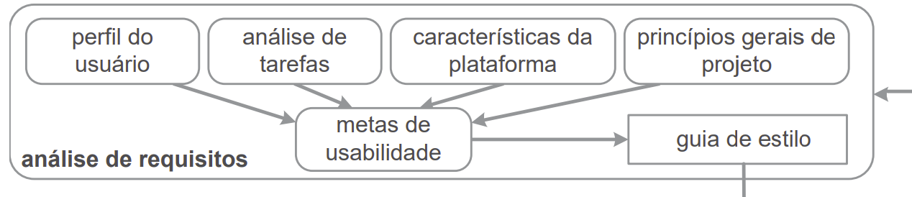
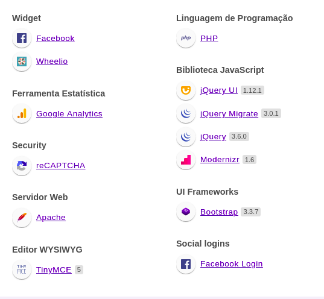
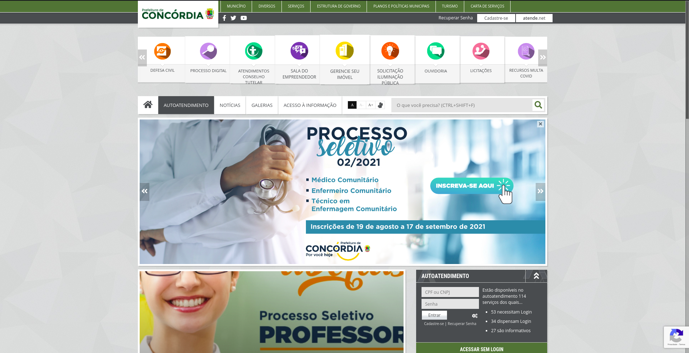
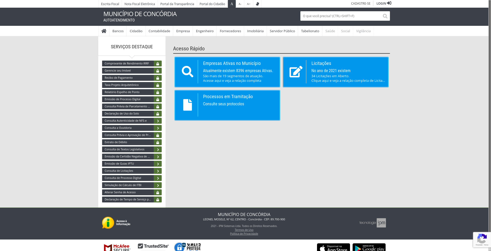
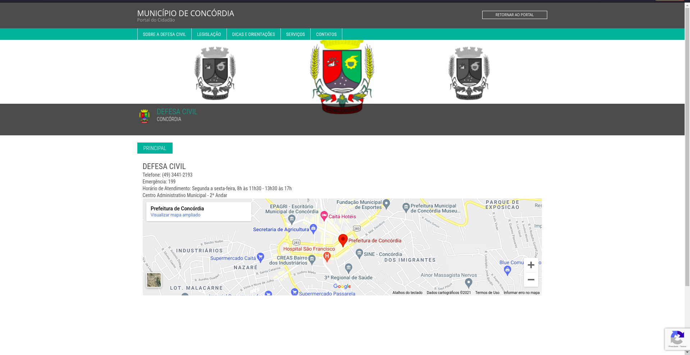
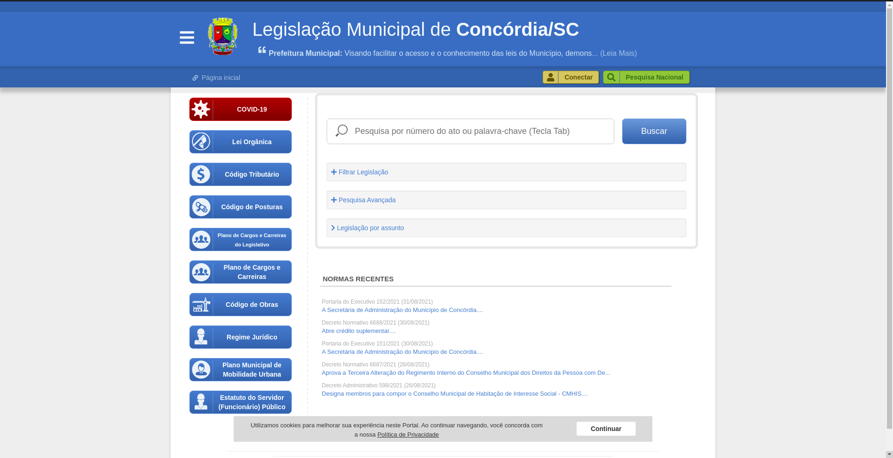
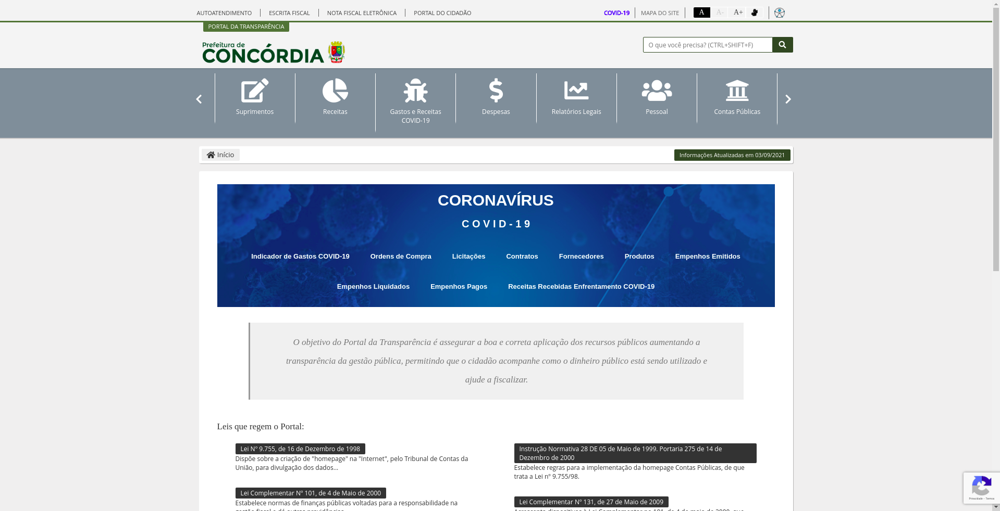

## Versionamento
|Data|Versão|Descrição|Autor(es)
|--|--|--|--|
|02/09|1.0|Criação do documento e descrição|Leonardo Takehana|

## 1. Introdução

 &emsp;&emsp; Como parte da análise de requisitos no ciclo de vida de Mayhew, as características da plataforma estão relacionadas com as características do usuário e também com os critérios de usabilidade,sendo uma análise, onde são levantadas as tecnologias, portabilidade, dentre outros aspectos importantes da plataforma, sendo levado em conta o que é desejado pelo usuário e quais características principais o produto deve ter. 

<h6 align = "center">Figura 1: Análise de requisitos do ciclo de vida de Mayhew.</h6>
<h6 align = "center">Fonte: Diniz <i>et al.</i> (2021, pág. 106)[1].</h6>

## 2. Objetivo

 &emsp;&emsp; O objetivo deste documento é detalhar as características do site da prefeitura de Concórdia, a fim de realizar o levantamento de requisitos para elaborar uma proposta de intervenção na melhoria da plataforma.
 

## 3. Portabilidade

 &emsp;&emsp; Definida pela ISO/IEC 25010, portabilidade é uma das características de qualidade que se define como: “Grau de eficácia e eficiência com que um sistema, produto ou componente pode ser transferido de um hardware, software ou outro ambiente operacional ou de uso para outro”. [2]

 &emsp;&emsp; Para avaliar o sistema foram utilizados 5 navegadores, sendo eles o Firefox, Google Chrome, Chromium, Microsoft edge e internet Explorer, sendo que apenas nesse último o sistema não foi campatível. Além disso o sistema possui uma adaptabilidade boa entre o acesso desktop e mobile, sendo bastante responsivo, apesar de em alguns pontos possuir excesso de informação, principalmente na versão mobile.

## 4. Tecnologias utilizadas
A figura abaixo contém todas as tecnologias a partir da extensão webalyzer do Google Chrome.

<h6 align = "center">Figura 2: Análise de tecnologias utilizadas no site.</h6>
<h6 align = "center">Fonte: Webalyzer.</h6>

## 5. Funcionálidades

 &emsp;&emsp; O site é focado em resolver problemas do cotidiano dos moradores da cidade, empresários e pessoas que prestam serviços, ele contem diversas funcionálidades e seções com diferentes objetivos, sendo possível:
  
- Ler notícias sobre a cidade; 
- Emitir documentos de impostos como IPTU; 
- Emitir certidão negativa de débitos; 
- Emitir nota fiscal; 
- Acessar informações para contato com a prefeitura; 
- Reportar problemas com a iluminação; 
- Ler a legislação municipal; 
- Acesso a ouvidoria; 
- Acesso a transparência dos gastos; 
- Acompanhamento de processos digitais; 
- Acesso a licitações; 
- Acesso a defesa civil; 
- Acesso a informações sobre a cidade de Concórdia; 
- Informações sobre a covid-19. 

## 6. Características negativas

 &emsp;&emsp; O site possui diversos problemas de usabilidade que podem ser analisados, como por exemplo a falta de padronização dos estilos dependendo da página onde se encontra, sendo que isso causa bastante desconforto ao navegar pelo site, além disso, em muitas das páginas há um excesso de informação, o que causa uma confusão ao usuário que quer buscar uma solução específica. Outra característica negativa é a existencia de muitos caminhos diferentes para realizar uma mesma ação, onde essas diferentes rotas causam estranheza ao usuário.

<h6 align = "center">Figura 3: Página inicial da prefeitura.</h6>
<h6 align = "center">Fonte: Prefeitura de Concórdia [3].</h6>

<h6 align = "center">Figura 4: Página de autoatendimento da prefeitura.</h6>
<h6 align = "center">Fonte: Prefeitura de Concórdia [3].</h6>

<h6 align = "center">Figura 5: Página de defesa civil da prefeitura de concórdia.</h6>
<h6 align = "center">Fonte: Prefeitura de Concórdia [3].</h6>

<h6 align = "center">Figura 6: Página de legislação municipal da prefeitura de concórdia.</h6>
<h6 align = "center">Fonte: Prefeitura de Concórdia [3].</h6>

<h6 align = "center">Figura 7: Portal da transparência da prefeitura de Concórdia.</h6>
<h6 align = "center">Fonte: Prefeitura de Concórdia [3].</h6>

## 7. Referências

[1] Barbosa, S. D. J.; Silva, B. S. da; Silveira, M. S.; Gasparini, I.; Darin, T.; Barbosa, G. D. J. <b>Interação Humano-Computador e Experiência do usuário</b>. Autopublicação. 2021.

[2] ISO / IEC 25010. ISO 25000, 2011. Disponível em: [<a href="https://iso25000.com/index.php/en/iso-25000-standards/iso-25010?start=6">https://iso25000.com/index.php/en/iso-25000-standards/iso-25010?start=6</a>]. Acesso em: 01 de setembro de 2021.

[3] Prefeitura de Concórdia. Disponível em: [<a href="https://concordia.atende.net/">https://concordia.atende.net/</a>]. Acesso em: 01 de setembro de 2021.
