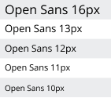
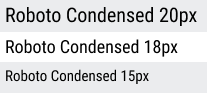

## Versionamento
|Data|Versão|Descrição|Autor(es)
|--|--|--|--|
|02/09|1.0|Inicialização do documento guia de estilo|Natanael Filho e Abraão|
|02/09|1.1|Adição dos elementos de interface|Natanael Filho e Abraão|

## 1. Introdução

 &emsp;&emsp;O guia de estilo é um documento que auxilia as equipes a acompanhar as decisões de design tomadas durante o projeto pela equipe de design. Dessa forma, asseguram que o estilo seja implementado no produto final.

 &emsp;&emsp; O documento possui como público alvo os gerentes do projeto, equipes de desenvolvimento, programadores e equipes de suporte. Por ser um documento que registro o design, ele será constantemente consultado e reutilizado pelas equipes. 

 &emsp;&emsp;Além disso, o guia facilita a manutenção de padrão da interfaces do sistema, pois ajudam as equipes de desenvolvimento a não se perderem.

### 1.1 Metodologia

 &emsp;&emsp; A metodologia usada para a construção deste projeto e a metodologia proposta por Marcus(1992), é foram considerados os seguintes elementos de design:

- Layout: proporção e grids; uso de metáforas espaciais; design gráfico de exibidores e ferramentas.
-  Tipografia e seu uso em diálogos, formulários e relatórios.
- Cores: os dez mandamentos sobre o uso de cores.
- Simbolismo: clareza e consistência no design de ícones.
- Visualização de informação: design de gráficos, diagramas e mapas;
- Design de telas e elementos de interface(widgets).

## 2. Resultado de análise
### 2.1 Descrição do ambiente de trabalho do usuário

 &emsp;&emsp; Ao acessar o site o usuário se depara com uma página voltada a mostrar as notícias mais recentes da cidade de Concórdia, a página inicial também possui uma navbar com diversos botões e uma campo de pesquisa. Ao clicar em qualquer um dos botões ou usar o campo de pesquisa da navbar o usuário consegue navegar por todas as regiões do site.

## 3. Elementos de interface

### 3.2 Janelas

 &emsp;&emsp; O site possui inúmeras janelas. Existem janelas para visualizar notícias, para saber mais sobre a história da cidade, acessar contatos, entre outras janelas. A seguir, encontra-se alguns exemplos de janelas do site.

<h6 align = "center">Imagem X: Janela de galeria de fotos</h6>
<h6 align = "center">Fonte: Autor</h6>

<h6 align = "center">Imagem X: janela de acesso à informação</h6>
<h6 align = "center">Fonte: Autor</h6>

<h6 align = "center">Imagem X: Janela de notícias</h6>
<h6 align = "center">Fonte: Autor</h6>

### 3.3 Tipografia

 &emsp;&emsp; O site possui duas categorias de tipografia, sendo um principal usado na maior parte dos textos e outro utilizado apenas para títulos. Temos como principal a fonte Open Sans, utilizada sempre no estado regular com algumas variações de tamanho.

<h6 align = "center">Imagem X: tamanhos da tipografia Open Sans no sistema.</h6>
<h6 align = "center">Fonte: Autor.</h6>

 &emsp;&emsp; Já a Roboto Condensed também aparece no estado regular, porém, aparece em tamanhos maiores por se tratar de títulos. 

<h6 align = "center">Imagem X: tamanhos da tipografia Roboto Condensed no sistema.</h6>
<h6 align = "center">Fonte: Autor.</h6>

### 3.4 Símbolos não tipográficos

 &emsp;&emsp; Os símbolos não tipográficos que o site apresenta estão relacionados a acessos rápidos, sendo eles :

- Relacionados a redes social da prefeitura.

<h6 align = "center">Imagem X: símbolos de redes sociais.</h6>
<h6 align = "center">Fonte: Autor.</h6>

- Imagem relacionadas a interação realizada pelo usuário, de modo a ajudar a reconhecer a funcionalidade.

|**Icone**|**Descrição**|
|--|--|
||Processo Digital|
||Atendimentos conselho tutelar|
||Sala do empreendedor|
||Gerencie seu imóvel|
||Solicitação iluminação pública|
||Ouvidoria|
||Licitações|
||Recursos multa covid|
||Legislação municipal|
||Defesa Civil|

<h6 align = "center">Tabela X: símbolos do menu rápido rotativo.</h6>
<h6 align = "center">Fonte: Autor.</h6>

### 3.5 Cores

Seguindo o padrão de cores da prefeitura de Concórdia temos a seguinte paleta:

<h6 align = "center">Imagem X: Paleta de cores.</h6>
<h6 align = "center">Fonte: Autor.</h6>

### 3.6 Animações

 &emsp;&emsp;Os elementos interativos do site são animados, logo, quando passamos o mouse neles, apresentam alguma animação, desde mudança de cor, avanço de tela, mostrando que aquele elemento é interativo. Além disso, o site possui animações que dão feedback sobre o carregamento de páginas, dessa forma o usuário consegue ter certeza que a sua interação está sendo efetuada.

## Referências