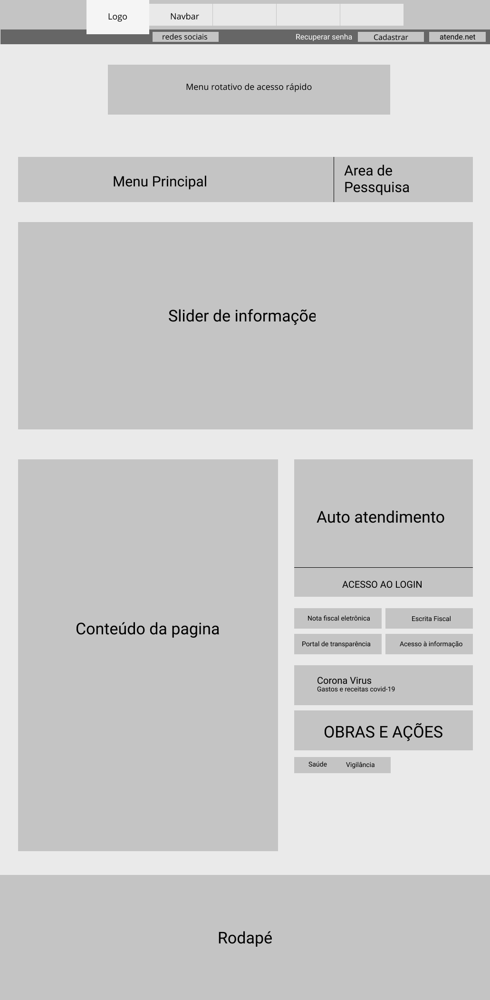
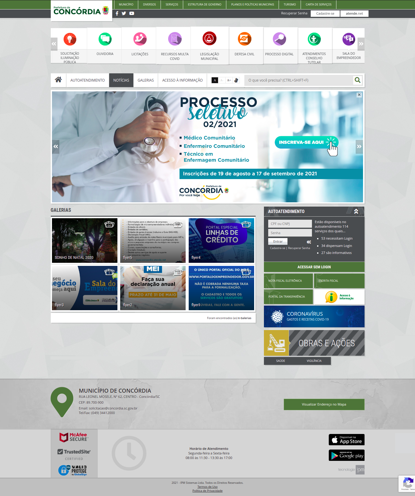
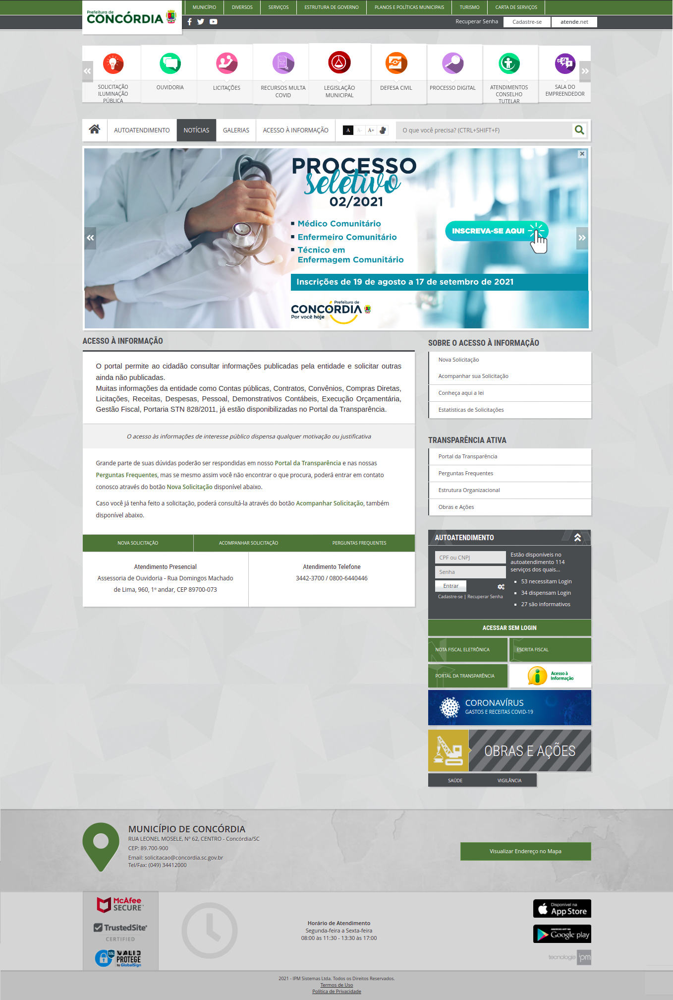
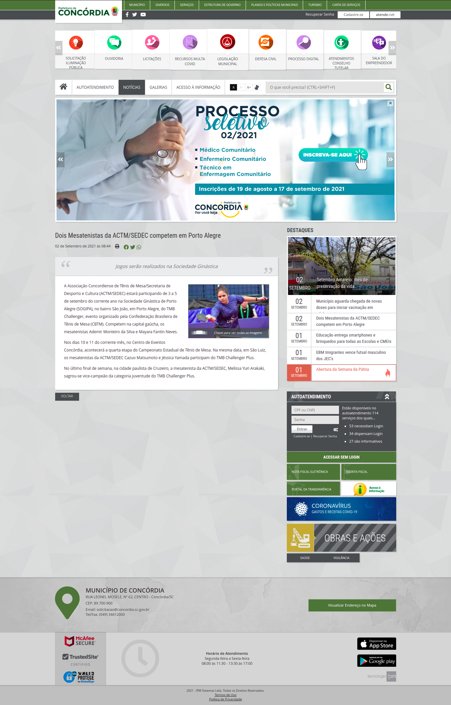
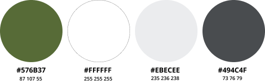
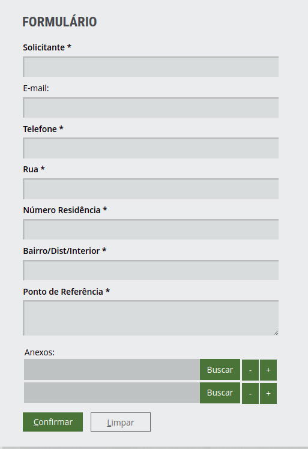
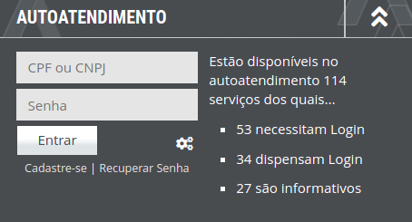
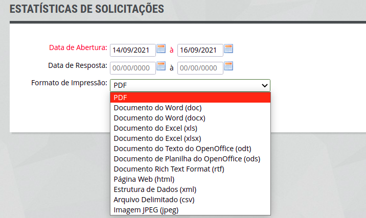

## Versionamento
|Data|Versão|Descrição|Autor(es)
|--|--|--|--|
|02/09|1.0|Inicialização do documento guia de estilo|Natanael Filho e Abraão|
|02/09|1.1|Adição dos elementos de interface|Natanael Filho e Abraão|
|02/09|1.2|Adição dos documento de elementos de ação, elementos de  interação e vocabulário e padrões de interface|Natanael Filho e Abraão|

## 1. Introdução

 &emsp;&emsp;O guia de estilo é um documento que auxilia as equipes a acompanhar as decisões de design tomadas durante o projeto pela equipe de design. Dessa forma, asseguram que o estilo seja implementado no produto final.

 &emsp;&emsp; O documento possui como público alvo os gerentes do projeto, equipes de desenvolvimento, programadores e equipes de suporte. Por ser um documento que registra o design, ele será constantemente consultado e reutilizado pelas equipes. Além disso, o guia facilita a manutenção de padrão das interfaces do sistema, pois ajudam as equipes de desenvolvimento a não se perderem.

### 1.1 Metodologia

 &emsp;&emsp; A metodologia usada para a construção deste projeto é a metodologia proposta por Marcus(1992) [1], onde são considerados os seguintes elementos de design:

- Layout: proporção e grids; uso de metáforas espaciais; design gráfico de exibidores e ferramentas.
-  Tipografia e seu uso em diálogos, formulários e relatórios.
- Cores: os dez mandamentos sobre o uso de cores.
- Simbolismo: clareza e consistência no design de ícones.
- Visualização de informação: design de gráficos, diagramas e mapas;
- Design de telas e elementos de interface(widgets).

## 2. Resultado de análise
### 2.1 Descrição do ambiente de trabalho do usuário

 &emsp;&emsp; O grid está apresentado de uma forma um pouco confusa em relação a barras de menu, pois existem três opções na parte superior de todas as páginas, causando desorientação do usuário. A barra de menu de autoatendimento ocupa muito espaço lateral da página com um conteúdo pouco relevante, atrapalhando a experiência de usuário ao ler o conteúdo principal da página.

## 3. Elementos de interface

### 3.1 Disposição espacial e grid

 &emsp;&emsp; O grid está apresentado de uma forma um pouco confusa em relação aos menus, pois existem três menus na parte superior de todas as paginas causando desorientação do usuário. O menu de autoatendimento ocupa muito espaço lateral da página com um conteúdo pouco relevante, atrapalhando a experiência de usuário ao ler o conteúdo principal da página.

<h6 align = "center">Imagem 1: Grid da página.</h6>
<h6 align = "center">Fonte: Autor.</h6>

### 3.2 Janelas

 &emsp;&emsp; O site possui inúmeras janelas. Existem janelas para visualizar notícias, para saber mais sobre a história da cidade, acessar contatos, entre outras janelas. A seguir, alguns exemplos de janelas do site.

<h6 align = "center">Imagem 2: Janela de galeria de fotos.</h6>
<h6 align = "center">Fonte: Autor.</h6>

<h6 align = "center">Imagem 3: janela de acesso à informação.</h6>
<h6 align = "center">Fonte: Autor.</h6>

<h6 align = "center">Imagem 4: Janela de notícias.</h6>
<h6 align = "center">Fonte: Autor.</h6>

### 3.3 Tipografia

 &emsp;&emsp; O site possui duas categorias de tipografia, sendo um principal usado na maior parte dos textos e outro utilizado apenas para títulos. Temos como principal a fonte Open Sans, utilizada sempre no estado regular com algumas variações de tamanho.

<h6 align = "center">Imagem 5: tamanhos da tipografia Open Sans no sistema.</h6>
<h6 align = "center">Fonte: Autor.</h6>

 &emsp;&emsp; Já a Roboto Condensed também aparece no estado regular, porém, aparece em tamanhos maiores por se tratar de títulos. 

<h6 align = "center">Imagem 6: tamanhos da tipografia Roboto Condensed no sistema.</h6>
<h6 align = "center">Fonte: Autor.</h6>

### 3.4 Símbolos não tipográficos

 &emsp;&emsp; Os símbolos não tipográficos que o site apresenta estão relacionados a acessos rápidos, sendo eles:

- Relacionados a redes sociais da prefeitura.

<h6 align = "center">Imagem 7: símbolos de redes sociais.</h6>
<h6 align = "center">Fonte: Autor.</h6>

- Imagem relacionadas a interação realizada pelo usuário, de modo a ajudar a reconhecer a funcionalidade.

|**Icone**|**Descrição**|
|--|--|
||Processo Digital|
||Atendimentos conselho tutelar|
||Sala do empreendedor|
||Gerencie seu imóvel|
||Solicitação de iluminação pública|
||Ouvidoria|
||Licitações|
||Recursos multa covid|
||Legislação municipal|
||Defesa Civil|

<h6 align = "center">Tabela 1: símbolos do menu rápido rotativo.</h6>
<h6 align = "center">Fonte: Autor.</h6>

### 3.5 Cores

 &emsp;&emsp; Seguindo o padrão de cores da logo da prefeitura de Concórdia temos a seguinte paleta:

<h6 align = "center">Imagem 8: Paleta de cores a partir da logo.</h6>
<h6 align = "center">Fonte: Autor.</h6>

 &emsp;&emsp; Já o site apresenta em sua estrutura apenas o verde-escuro ao longo da navegação, e apenas em ícones pequenos as outras cores. Com isso, formamos a seguinte paleta para o site:

<h6 align = "center">Imagem 9: Paleta de cores a partir da análise do site.</h6>
<h6 align = "center">Fonte: Autor.</h6>

### 3.6 Animações

 &emsp;&emsp;Os elementos interativos do site são animados, logo, quando passamos o mouse neles, apresentam alguma animação, desde mudança de cor, avanço de tela, mostrando que aquele elemento é interativo. Além disso, o site possui animações que dão feedback sobre o carregamento de páginas, dessa forma o usuário consegue ter certeza que a sua interação está sendo efetuada.

## 4 Elementos de interação

### 4.1 Estilos de interação

 &emsp;&emsp; Os estilos de interação mais utilizados no site são: os de menus, que possibilitam a navegação do usuário pelo site e linguagem natural que indicam onde e o que o usuário pode fazer; WIMP (window, icon, menu, pointing device) sendo a utilização de ícones, barras de menu e ações com o mouse e Preenchimento de Formulários utilizados principalmente para entrada de dados em sistemas de informação aumentando o nível de comunicação. 

### 4.2 Seleção de um estilo

 &emsp;&emsp;  
O menu é o estilo com mais presença no site. Dessa forma, o usuário seleciona opções na barra de menu e tenta utilizar suas funcionalidades. 

### 4.3 Aceleradores (Teclas de atalho)

 &emsp;&emsp; A aplicação possui apenas um acelerador, sendo um acelerador ligado a ferramenta de busca da aplicação. Ao pressionar a sequência de botões "CTRL+SHIFT+F", o sistema é direcionado para efetuar uma busca.

## Elementos de ação

### 5.1 Preenchimento de campo 

 &emsp;&emsp; No site os campos de preenchimento estão relacionados a formulários e a campos acesso do usuário. Um exemplo de formulários temos a solicitação de iluminação pública, onde o usuário preenche campos com informações de endereço e de quem é o solicitante.

<h6 align = "center">Imagem 10: formulário de solicitação de iluminação pública.</h6>
<h6 align = "center">Fonte: Autor.</h6>

 &emsp;&emsp;Também, já como exemplo de campo de acesso, temos o campo de autoatendimento, que é um campo onde o usuário informa seu CPF e sua senha para ter acesso ao auto atendimento.

<h6 align = "center">Imagem 11: formulário de solicitação de autoatendimento.</h6>
<h6 align = "center">Fonte: Autor.</h6>

### 5.2 Seleção

 &emsp;&emsp; No caso apresentado na imagem 12 é necessário fazer o preenchimento dos campos de data de abertura e data de resposta, e selecionar o formato de impressão.

<h6 align = "center">Imagem 12: formulário de solicitação de documentos.</h6>
<h6 align = "center">Fonte: Autor.</h6>

### 5.3 Ativação
 
 &emsp;&emsp; Após todos os campos preenchidos corretamente, basta o usuário clicar no botão "confirmar", "imprimir" ou "entrar". 

## 6. Vocabulário e padrões

### 6.1 Terminologia

 &emsp;&emsp;  O site utiliza de uma linguagem simples e de fácil entendimento, na maior parte do conteúdo, o que corresponde com a linguagem usada pelos usuários. Apenas em documentos e conteúdos relacionados ao legislativo e administrativo, as terminologias não se adéquam aos usuários comuns, visto que o vocábulo não é passível de alteração.

### 6.2 Tipo de tela

 &emsp;&emsp;  O site possui uma tela padronizada durante a navegação principal (notícia, galeria, etc.), porém, durante acesso à emissão de documentos e transparências o site não está padronizado o que gera nos usuários um sentimento de confusão.

### 6.3 Sequências de diálogos

 &emsp;&emsp;  Após preenchimento de formulários, de forma correta, o sistema mostra uma mensagem escrita na tela "SUA SOLICITAÇÃO FOI ENVIADA COM SUCESSO", indicando ao usuário que a operação finalizou corretamente.

## 7. Referências

[1] Barbosa, S. D. J.; Silva, B. S. da; Silveira, M. S.; Gasparini, I.; Darin, T.; Barbosa, G. D. J. <b>Interação Humano-Computador e Experiência do usuário</b>. Autopublicação. 2021.

[2] 2020.1-Prefeiturade-Aguas-Lindas-de-Goias. <b>Guia de estilo</b>. Disponível em: <a href="https://interacao-humano-computador.github.io/2020.1-Prefeiturade-Aguas-Lindas-de-Goias/analise_requisitos/guia_estilo/">https://interacao-humano-computador.github.io/2020.1-Prefeiturade-Aguas-Lindas-de-Goias/analise_requisitos/guia_estilo/</a>. Acesso em: 2 de set. de 2021

