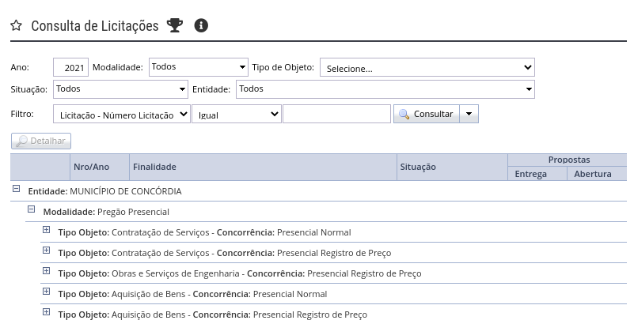
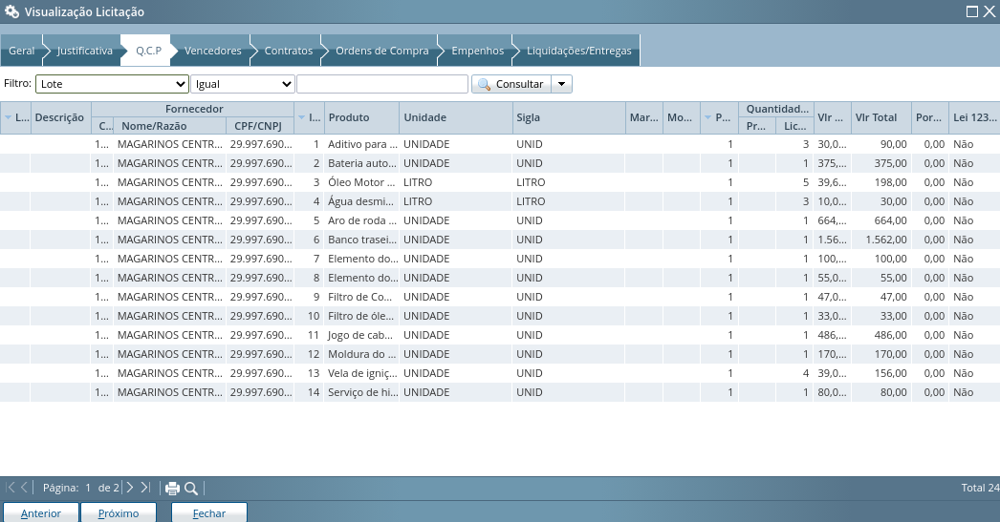
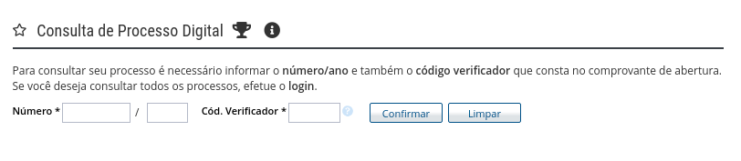
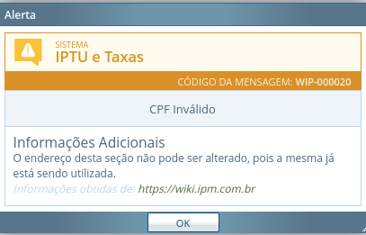

## 1. Versionamento
|Versão|Data|Descrição|Autor(es)|
|------|----|---------|---------|
|1.0|03/09|Criação do docuemnto| Francisco Ferreira|
|1.1|06/09|Corrigindo erros de português| Francisco Ferreira|

## 2. Introdução

 &emsp;&emsp; Baseando-se nos pesquisadores mais conhecidos que fizeram uma grande contribuição na literatura de IHC em relação a princípio e diretrizes: Norman(1998), Tognazzini (2003) e Nielsen(1993), surgem os princípios e diretrizes que guiam um projeto.

 &emsp;&emsp; Os <b>princípios</b>, segundo Barbosa <i>et al.</i> [1], são uma abordagem focada em objetivos gerais e de alto nível, por outro lado, as <b>diretrizes</b> têm como objetivo focar nas observações práticas, padrões e soluções específicas. Apesar de serem muito importantes, os levantamentos dos princípios e diretrizes não substituem em nenhuma hipótese o processo de atividade de design.

## 3. Princípios e Diretrizes Gerais

 &emsp;&emsp; Na maioria das vezes a abordagem dos princípios e diretrizes de IHC são apoiadas e giram em cima dos seguintes tópicos:

### 3.1 Simplicidade nas estruturas das tarefas: 

 &emsp;&emsp; Sempre devemos simplificar a estrutura das tarefas o máximo possível, assim reduzindo a quantidade de planejamento e resolução de problemas que elas requerem. As tarefas desnecessárias e complexas podem ser reestruturadas, utilizando inovações tecnológicas, assim podendo seguir as seguintes abordagens.

* Manter a tarefa a mesma, mas fornecendo diversas formas de apoio para que os usuários consigam aprender e realizar a tarefa; 

* Usar tecnologia para tornar visível o que seria invisível, melhorando o feedback e a capacidade do usuário se manter no controle da tarefa; 

* Automatizar a tarefa ou parte dela, mantendo-a igual; 

* Modificar a natureza da tarefa.

<h6 align = "center">Figura 1: Foto de simplicidade da estruturas de buscas.</h6>
<h6 align = "center">Fonte: Autor.</h6>

### 3.2 Equilíbrio entre controle e liberdade do usuário

 &emsp;&emsp;Quando é dada a liberdade para o usuário, devemos fazer algumas verificações, principalmente no sentindo de expor muitas informações para o usuário, visto que isso pode causar uma sensação de perda ou angústia. Devemos sempre que possível mostrar apenas a opções nescessárias para o usuário, assim ele tem uma grande curva de aprendizado, tendo a sensação de maestria no que está fazendo. Dessa maneira, devemos manter o sistema, o mais equilibrado possível.

<h6 align = "center">Figura 2: Visão geral de controle e liberdade do usuário da página de licitação.</h6>
<h6 align = "center">Fonte: Autor.</h6>

### 3.3 Consistência e padronização

 &emsp;&emsp;Devemos manter a consistência e padronização da interface do modelo conceitual que está embutido no sistema, para assim facilitar o aprendizado e uso do sistema. Por assim dizer, os usuários não devem ter que se perguntar se palavras, situações ou ações diferentes significam a mesma coisa, por outro lado, se dois elementos de interface possuem comportamentos diferentes eles devem ter aparências distintas.

### 3.4 Promoção da eficiência do usuário

 &emsp;&emsp;Segundo Tognazzini(2003), devemos sempre considerar a eficiência do usuário em primeiro lugar, e não do computador. Esse cuidado costumam trazer bem mais benefícios do que investimentos em processamentos ou armazenamento.

### 3.5 Antecipação 

 &emsp;&emsp;As aplicações devem, sempre que possível, tentar prever o que o usuário quer e precisa naquele momento específico para que assim não se espere que os mesmos busquem ou coletem informações, ou invoquem ferramentas para resolver seu problema. Portanto, a aplicação deve ajudar o usuário fornecendo todas as informações e ferramentas necessárias para cada passo do processo.

<h6 align = "center">Figura 3: Página que requer uma certa eficiencia tecnológica do usuário.</h6>
<h6 align = "center">Fonte: Autor.</h6>

### 3.6 Visibilidade e reconhecimento 

 &emsp;&emsp;Segundo Norman(1988), o designer deve tornar as coisas o mais visível possível, abreviar possibilidades de execução e avaliação. Antes de executar uma ação, é necessário tornar visível para os usuários o que é possível realizar e como as ações devem ser feitas, diferentemente disso o sistema não deve exigir que o usuário memorize muitas informações durante a interação com o sistema.

<h6 align = "center">Figura 4: Avisos bem claros e diretos.</h6>
<h6 align = "center">Fonte: Autor.</h6>

### 3.7 Conteúdo relevante e expressão adequada:

 &emsp;&emsp; Uma interação de boa qualidade segue quatro tópicos: qualidade, quantidade, relação e clareza.

* **O topico da qualidade:** Afirma que não devemos dizer nada que saibamos não ser verdade ou para o que não tenhamos evidências, ou seja, não devemos mentir ou especular. 
* **O topico da quantidade:** Diz respeito à quantidade de informação comunicada: a contribuição de uma fala deve ser tão informativa quanto necessário para os objetivos da conversa, e não mais. Uma constante dentre os profissionais de IHC é a busca pela simplicidade. Seguem o lema “menos é mais”.
* **O topico das quantidade:** Está fortemente relacionada à simplicidade da interface. 
* **O topico da relação ou relevância** Afirma que tudo o que for dito deve ter relação clara com os tópicos da conversa até o momento e ser relevante ao objetivo dos interlocutores. 
* **O topico da clareza** pede para evitar a prolixidade e ambiguidade, buscar a concisão e ordenar adequadamente a conversa.

### 3.8 Projeto para erros

 &emsp;&emsp; Assumimos que qualquer erro potencial será cometido. O designer deve preparar o sistema para ajudar o usuário a se recuperar de um erro que ele não conhece informando-lhe sobre o que, o porque e como resolver esse problema.

<h6 align = "center">Figura 5: Alerta de erro objetivo.</h6>
<h6 align = "center">Fonte: Autor.</h6>

## 4 Bibliografia

[1] Barbosa, S. D. J.; Silva, B. S. da; Silveira, M. S.; Gasparini, I.; Darin, T.; Barbosa, G. D. J. <b>Interação Humano-Computador e Experiência do usuário</b>. Autopublicação. 2021.

