## Versionamento
|Data|Versão|Descrição|Autor(es)
|--|--|--|--|
|23/08|1.0|Criação do documento|João Pedro|
|24/08|1.1|Adição das respostas do questionário|João Pedro|
|24/08|1.2|Adição dos perfis de usuários|Natanael|

## 1. Introdução

 &emsp;&emsp; Em todos o projetos de softwares é importante se entender quem são os usuários. Para isso diversas técnicas podem ser utilizadas, e uma delas são os <b>Questionários</b> [1]. Nessa metodologia, o público é avaliado respondendo perguntas, em sua maioria fechadas, para se entender quem são, quais são seus objetivos e suas motivações. Para a obtenção de dados que correspondam a realidade dos moradores de Concórdia, esse questionário foi desenvolvido de forma a abranger apenas os usuários reais, ou seja, todos os entrevistados são moradores reais da cidade de Concórdia-SC.

## 2. Resultados
### 2.1 Questão 1

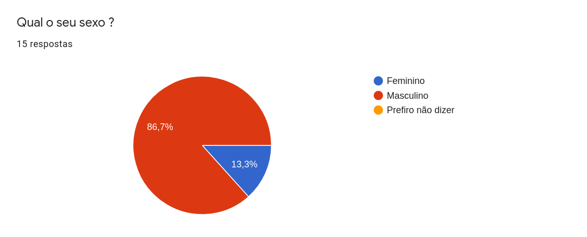

<h6 align = "center">Imagem 1: Pergunta 1 do questionário.</h6>
<h6 align = "center">Fonte: Autor.</h6>
### 2.2 Questão 2

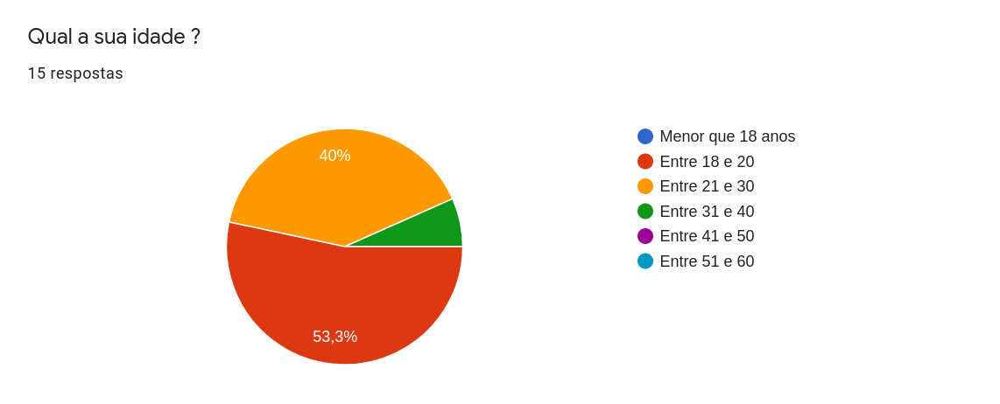

<h6 align = "center">Imagem 2: Pergunta 2 do questionário.</h6>
<h6 align = "center">Fonte: Autor.</h6>
### 2.3 Questão 3

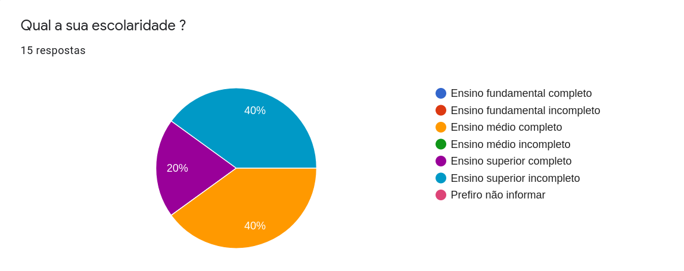

<h6 align = "center">Imagem 3: Pergunta 3 do questionário.</h6>
<h6 align = "center">Fonte: Autor.</h6>
### 2.4 Questão 4

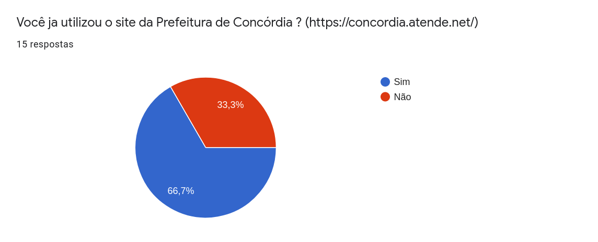

<h6 align = "center">Imagem 4: Pergunta 4 do questionário.</h6>
<h6 align = "center">Fonte: Autor.</h6>
### 2.5 Questão 5

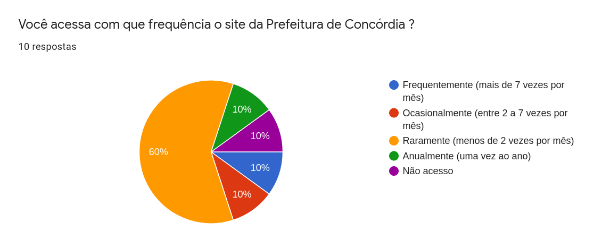

<h6 align = "center">Imagem 5: Pergunta 5 do questionário.</h6>
<h6 align = "center">Fonte: Autor.</h6>
### 2.6 Questão 6

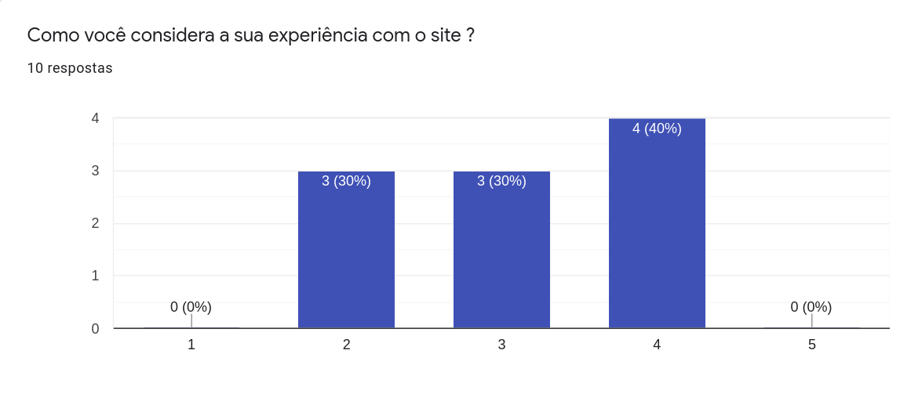

<h6 align = "center">Imagem 6: Pergunta 6 do questionário.</h6>
<h6 align = "center">Fonte: Autor.</h6>
### 2.7 Questão 7

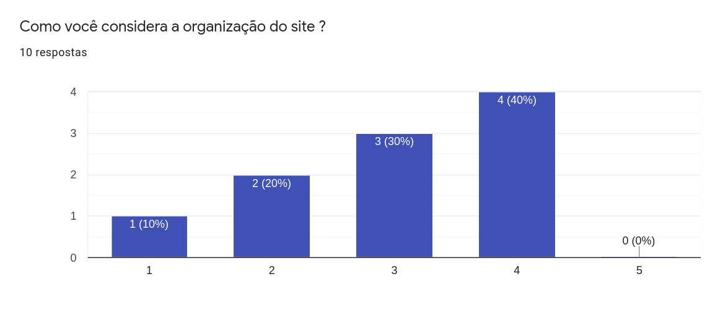

<h6 align = "center">Imagem 7: Pergunta 7 do questionário.</h6>
<h6 align = "center">Fonte: Autor.</h6>
### 2.8 Questão 8

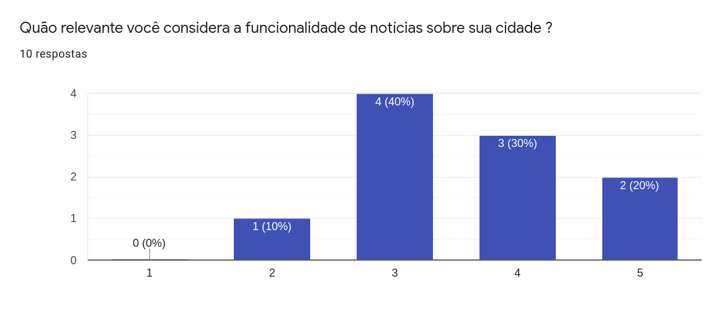

<h6 align = "center">Imagem 8: Pergunta 8 do questionário.</h6>
<h6 align = "center">Fonte: Autor.</h6>
### 2.9 Questão 9

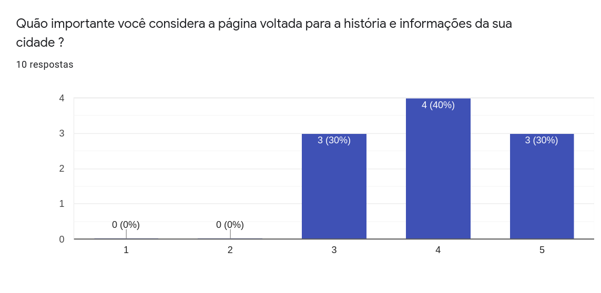

<h6 align = "center">Imagem 9: Pergunta 9 do questionário.</h6>
<h6 align = "center">Fonte: Autor.</h6>
### 2.10 Questão 10

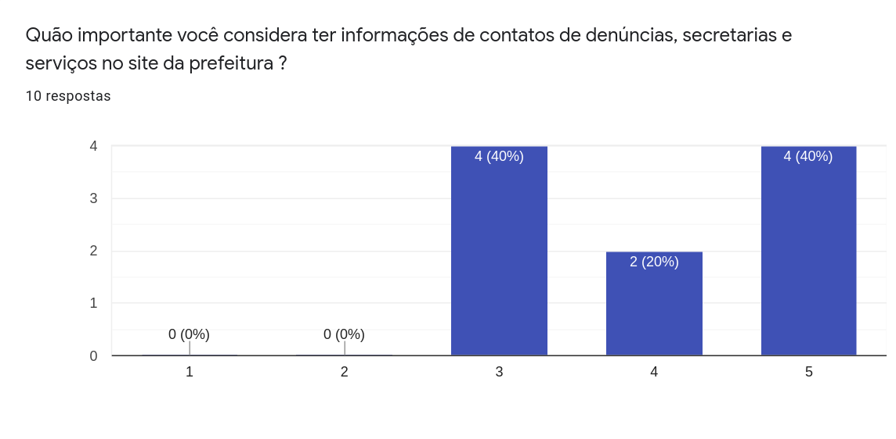

<h6 align = "center">Imagem 10: Pergunta 10 do questionário.</h6>
<h6 align = "center">Fonte: Autor.</h6>
### 2.11 Questão 11

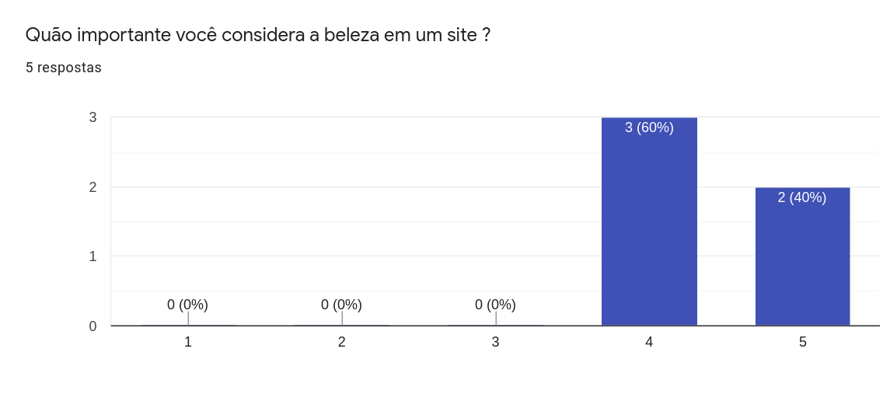

<h6 align = "center">Imagem 11: Pergunta 11 do questionário.</h6>
<h6 align = "center">Fonte: Autor.</h6>
### 2.12 Questão 12

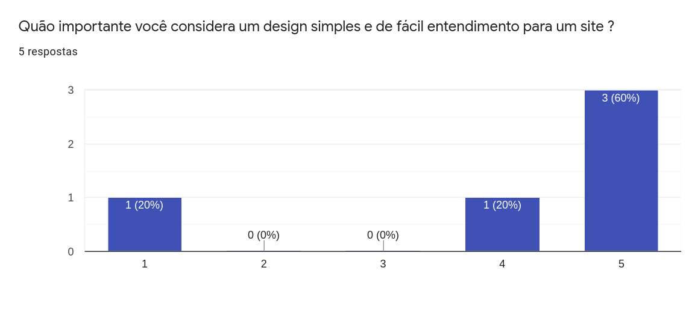

<h6 align = "center">Imagem 12: Pergunta 12 do questionário.</h6>
<h6 align = "center">Fonte: Autor.</h6>
### 2.13 Questão 13

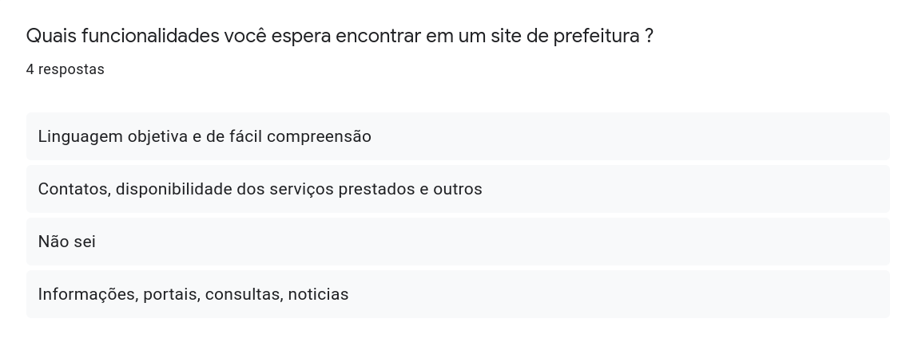

<h6 align = "center">Imagem 13: Pergunta 13 do questionário.</h6>
<h6 align = "center">Fonte: Autor.</h6>

## 3. Perfis de Usuários
### 3.1 Coleta de dados

 &emsp;&emsp; Para traçarmos um perfil de usuário mais adequado, criamos um questionário e disponibilizamos para alguns moradores de Concórdia preencherem entre os dias 19 e 24 de agosto de 2021. Assim sendo, a partir dos dados coletados concluímos algumas características que se repetiram entre os usuários e atribuímos ao perfil de usuário.

### 3.2 Análise dos dados coletados

 &emsp;&emsp; A partir dos dados coletados é possível dizer que:

- A maioria dos usuários tem entre 18 e 30 anos.
- A maior parte dos participantes estão cursando ensino superior ou possuem apenas o ensino médio completo.
- A maioria raramente utiliza o site, ou seja, menos de 2 vezes por mês.
- Parte considerável dos participantes que raramente usam o site afirmaram que a organização do site é ruim e a experiência de uso foi ruim.
- Para os usuários é muito importante que possam fazer denúncias e ter contato com a secretária da prefeitura.
- Para os participantes um site de prefeitura deve ser atrativo, organizado e fácil entendimento.
- Para os usuários o site deve ser um bom meio de se informação sobre a cidade.
- As funcionalidades do site executam suas ações corretamente, porém, poderiam ser um pouco mais organizadas.

### 3.3 Perfil de usuário traçado
|**Características**|**Descrição**|
|--|--|
|**Idade**| Maioria dos usuários estão **entre 18 e 30 anos**.|
|**Sexo**| **Maioria masculina**, porém os dados não são suficientes para afirmar total predominância.|
|**Serviços mais procurados**|Procuram **informações sobre a cidade** ou fazer **denúncias, solicitações, entre outros, para as secretárias da prefeitura**.|
|**Navegação desejada**|Navegação **rápida** e **prática**, onde o usuário após realizar o que deseja, sairá da página.|

 &emsp;&emsp; Em suma o site da Prefeitura de Concórdia possui usuários jovens e adultos, que buscam uma navegação que não demore, já que, por exemplo, após uma solicitação de iluminação o usuário provavelmente fechará a página e fará outra coisa. Além disso, eles querem que a informação do site seja de confiança e possam entrar em contato direto com as secretária da prefeitura.

## 4. Referências

[1] Wiegers, K.; Beatty J. <b>Software Requirements</b>. Third Edition. 2013.

