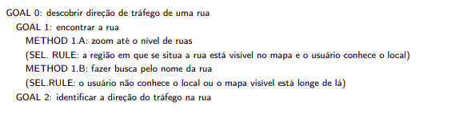

## Versionamento
|Data|Versão|Descrição|Autor(es)
|--|--|--|--|
|22/08|1.0|Criação de documento|Abraão Alves|

## 1. Introdução

 &emsp;&emsp; O CMN-GOMS é um metodo que se refere a proposta original GOMS, nele
há uma hierarquia estrita de objetivos, os operadores são executados estritamente em ordem sequencial,
e os métodos são representados numa notação semelhante a um pseudocódigo, que inclui submétodos e
condicionais, portanto, a análise é geral e executável. Qualquer instância de classe de tarefas descrita pode ser realizada ou simulada seguindo os passos do modelo que podem passar por caminhos diferentes dependendo da situação específica da tarefa 

## 2. Elaboração

 &emsp;&emsp; Ao elaborar um modelo GOMS, devemos definir cuidadosamente o que representar e o que não representar. Tarefas mentais podem ser complexas, o nível de detalhes utilizado deve atender aos
objetivos da análise. Em etapas iniciais, costumamos representar as estratégias alternativas que o usuário
poderá seguir para atingir seus objetivos 

<h6 align = "center">Imagem 1: Exemplo de modelo CMN-GOMS sem detalhes.</h6>
<h6 align = "center">Figura retirada do livro Interação Humano-Computador de BARBOSA et al. (2021, pag.170)</h6>

  &emsp;&emsp;  os modelos CMN-GOMS permitem prever a sequência de operadores e o tempo
de execução. Qualitativamente, eles focam métodos para alcançar objetivos: métodos semelhantes são facilmente identificados, métodos atipicamente curtos ou longos se destacam e podem disparar ideias de
design, como, por exemplo, a inclusão de teclas de atalho para comandos frequentes e pontos de feedback
para o usuário.

## 3. Referências

[1] BARBOSA et al.<b>Interação Humano-Computador e Experiência do usuário</b>. Autopublicação. 2021.
