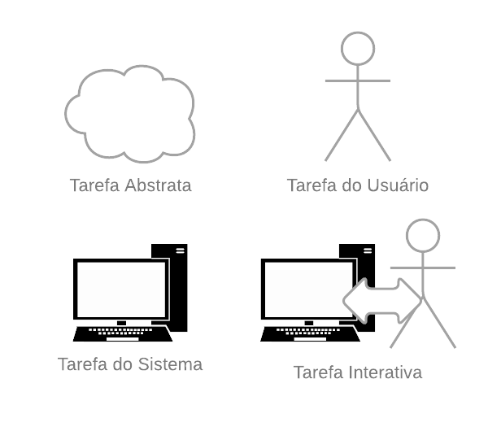
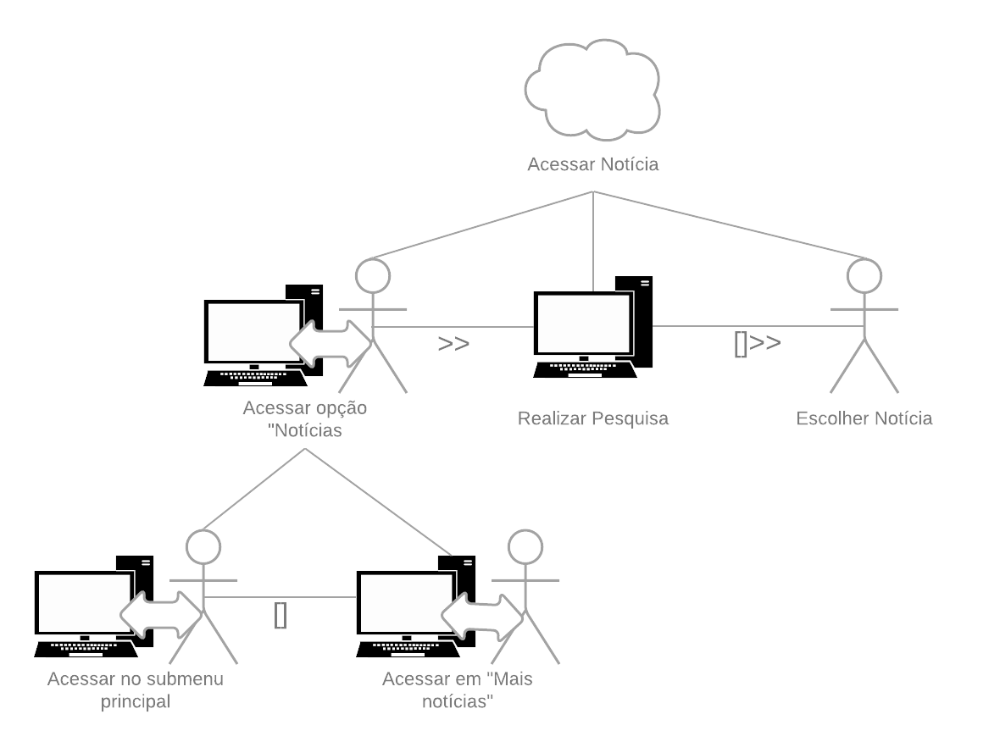
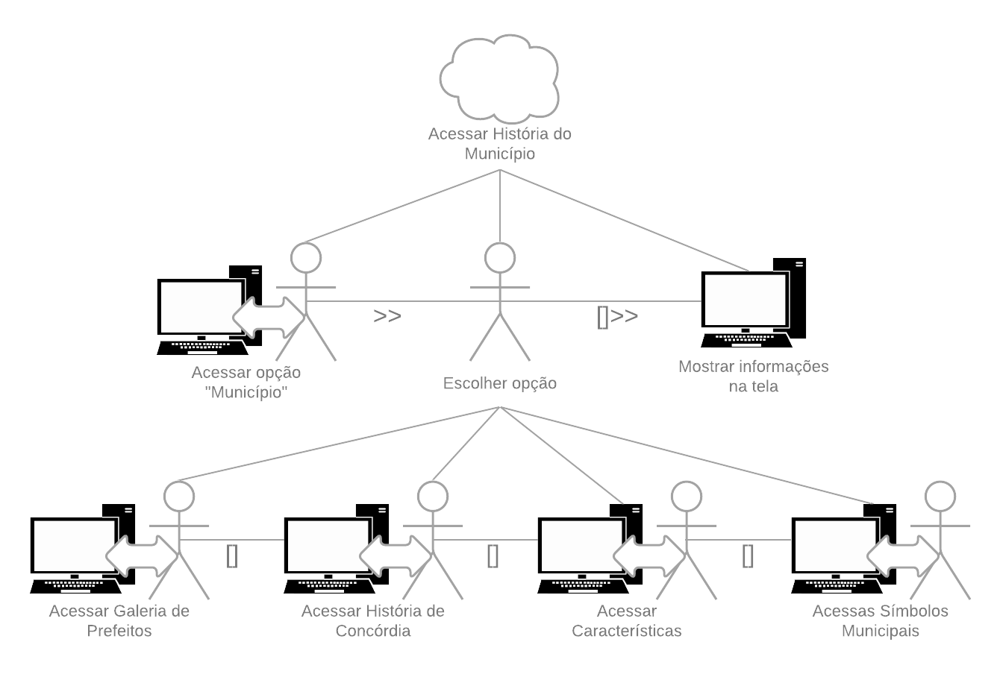

## Versionamento
|Data|Versão|Descrição|Autor(es)
|--|--|--|--|
|22/08|1.0|Criação do documento e adição da técnica|João Pedro|

## 1. Introdução

 &emsp;&emsp; Para se entender sobre como, por quê e quais são os trabalhos dos usuários são criadas as análises de tarefas (Diniz, 2021, pág. 163-164)[1]. Uma dessas técnicas é a <b>Árvore de Tarefas Concorrentes (CTT)</b>, que assim como as demais metodologias visa auxiliar a avaliação e o design de IHC. Nessa árvore, quatro tipos de tarefas podem ser analisadas, são elas:

- Tarefas do usuário: realizada fora do sistema.
- Tarefas do sistema: realizada pelo sistema sem a interação com o usuário.
- Tarefas interativas: realizadas com diálogos usuário-sistema
- Tarefas abstratas: não são tarefas em si, mas sim a representação de uma composição de tarefas que auxilia a decomposição.

<h6 align = "center">Imagem 1: Legenda de uma CTT.</h6>
<h6 align = "center">Fonte: Autor, baseado em Diniz <i>et al.</i> (2021, pág. 173)[1].</h6>

## 2. Nomeclaturas Utilizadas

 &emsp;&emsp; As árvores de tarefas concorrentes admitem 8 relacionamentos possíveis, são eles:
 

- <b>Ativação (T1 >> T2)</b>: T2 só inicia quando T1 terminar.
- <b>Ativação com passagem de informação (T1 [] >> T2)</b>: T2 só pode ser iniciada após T1 terminar e com as informações produzidas em T1 passadas para T2.
- <b>Escolhas (T1 [] T2)</b>: Uma das duas será escolhida e a outra desativada
- <b>Tarefas concorrentes (T1 ||| T2)</b>: Realizadas em qualquer ordem ou ao mesmo tempo.
- <b>Tarefas concorrentes e comunicantes (T1 |[]| T2)</b>: Além de serem concorrentes, podem trocar informações entre si.
- <b>Tarefas independentes (T1 |= |T2)</b>: Realizadas em qualquer ordem, porém apenas uma por vez.
- <b>Desativação (T1 [> T2)</b>: T1 é completamente interrompida por T2.
- <b>Suspensão/retomada (T1 |> T2)</b>: T1 é interrompida e pode voltar do ponto que parou quando T2 terminar.

## 3. Resultados
### 3.1 CTT Acesso a Notícias

<h6 align = "center">Imagem 2: Árvore concorrente de acesso à notícias.</h6>
<h6 align = "center">Fonte: Autor.</h6>

### 3.2 CTT Acesso a História de Concórdia

<h6 align = "center">Imagem 3: Árvore concorrente de acesso à história de Concórdia.</h6>
<h6 align = "center">Fonte: Autor.</h6>

## 4. Referências

[1] Barbosa, S. D. J.; Silva, B. S. da; Silveira, M. S.; Gasparini, I.; Darin, T.; Barbosa, G. D. J. <b>Interação Humano-Computador e Experiência do usuário</b>. Autopublicação. 2021.

