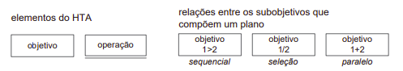
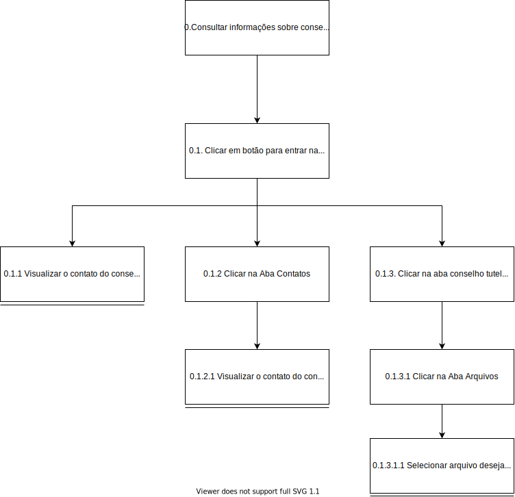
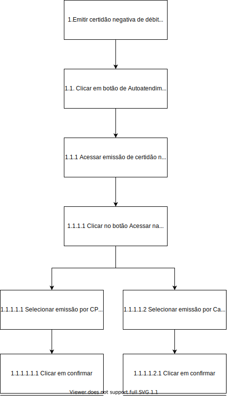

## Versionamento
|Data|Versão|Descrição|Autor(es)
|--|--|--|--|
|24/08|1.0|Criação do documento e adição da técnica|Leonardo Takehana|

## 1. Introdução

 &emsp;&emsp; A Análise Hierárquica de Tarefas (HTA), surgiu na década de 1960 para entender as competências e habilidades necessárias para realizar tarefas complexas que não se repetem, além de identificar problemas de desempenho.. Ela ajuda a relacionar o que as pessoas fazem (ou se recomenda que façam), por que o fazem,
e quais as consequências caso não o façam corretamente. Ela se baseia em psicologia funcional, e não
comportamental, como eram as abordagens da época em que foi criada.(Diniz, 2021, pág. 164-167)[1]. 

 &emsp;&emsp; O HTA, consiste em dividir atividade em tarefas, que são qualquer parte do trabalho que precisa ser realizada, além disso uma tarefa pode ser definida em objetivos e também em subobjetivos, dessa forma criando uma árvore hierárquica com vários níveis, que é de onde se deriva o seu nome, além disso os quadros podem indicar ou conter as ações que serão realizadas futuramente de acordo com a ordem, sequência ou seleção delas. 

<h6 align = "center">Imagem 1: Legenda de blocos do HTA.</h6>
<h6 align = "center">Fonte: Diniz <i>et al.</i> (2021, pág. 165)[1].</h6>

## 2. Nomeclaturas Utilizadas

 &emsp;&emsp; As relações entre objetivos utilizados em uma análise hierárquica podem ser definidas como:
 

- <b>Sequencial (T1>T2)</b>: T2 só inicia quando T1 terminar.
- <b>Seleção (T1/T2)</b>: Uma das duas, T1 ou T2, será escolhida e a outra desativada.
- <b>Paralelo (T1+T2)</b>: Realizadas em qualquer ordem ou ao mesmo tempo.

## 3. Resultados
### 3.1 HTA Consultar informações sobre conselho tutelar

<h6 align = "center">Imagem 2: HTA Consultar informações sobre conselho tutelar.</h6>
<h6 align = "center">Fonte: Autor.</h6>

|objetivos / operações |problemas e recomendações|
|--|--|
|0.Consultar informações sobre conselho tutelar|Tarefa que consiste em buscar informações sobre o conselho tutelar na prefeitura de concórdia|
0.1. Clicar em botão para entrar na página de contato com o conselho tutelar 1/2/3|Objetivo que consiste em buscar o botão para a página de contato do conselho tutelar na página principal|
|0.1.1 Visualizar o contato do conselho tutelar no final da página e realizar o telefonema|Subobjetivo que consiste em buscar o telefone ou email de contato do conselho tutelar na prefeitura de concórdia|
|0.1.2 Clicar na Aba Contatos|Subobjetivo que consiste em buscar o botão para selecionar a aba de contatos|
|0.1.2.1 Visualizar o contato do conselho tutelar no final da página e realizar o telefonema|Subobjetivo que consiste em buscar o telefone ou email de contato do conselho tutelar na prefeitura de concórdia|
|0.1.3. Clicar na aba conselho tutelar |Subobjetivo que consiste em buscar o botão para selecionar a aba do conselho tutelar|
|0.1.3.1 Clicar na Aba Arquivos |Subobjetivo que consiste em buscar o botão para selecionar a aba de arquivos, dentro da página do conselho tutelar|
|0.1.3.1.1 Selecionar arquivo desejado|Subobjetivo que consiste em procurar o documento em questão para ver as informações desejadas|
<h6 align = "center">Tabela 1: HTA Consultar informações sobre conselho tutelar em formato de tabela.</h6>
<h6 align = "center">Fonte: Autor.</h6>

### 3.2 HTA Emissão da certidão negativa de débitos

<h6 align = "center">Imagem 3: HTA Emissão da certidão negativa de débitos.</h6>
<h6 align = "center">Fonte: Autor.</h6>

|objetivos / operações |problemas e recomendações|
|--|--|
|1.Emitir certidão negativa de débitos|Tarefa que consiste em emitir a certidão negativa de débitos no site da prefeitura de concórdia|
1.1. Clicar em botão de Autoatendimento|Objetivo que consiste em buscar o botão para a página de autoatendimento na página principal|
|1.1.1 Acessar emissão de certidão negativa de débitos pelo menu de serviços destaque|Subobjetivo que consiste em buscar a página de emissão de certidão negativa de débitos localizada nos serviços destaque|
|1.1.1.1 Clicar no botão Acessar na página sobre CND 1/2|Subobjetivo que consiste em acessar a página através do botão de confirmação|
|1.1.1.1.1 Selecionar emissão por CPF/CNPJ, digitar o CNPJ ou CPF e selecionar a finalidade geral |Subobjetivo que consiste em digitar as informações do formulário caso queira acessar através de seu CPF ou CNPJ|
|1.1.1.1.1.1 Clicar em confirmar |Subobjetivo que consiste em clicar no botão de confirmar para ter acesso a declaração|
|1.1.1.1.2 Selecionar emissão por Cadastro imobiliário, digitar o numero do cadastro e selecionar a finalidade imobiliaria portal |Subobjetivo que consiste em digitar as informações do formulário caso queira acessar através de seu cadastro imobiliário|
|1.1.1.1.2.1 Clicar em confirmar|Subobjetivo que consiste em clicar no botão de confirmar para ter acesso a declaração|
<h6 align = "center">Tabela 2: HTA Emissão da certidão negativa de débitos em formato de tabela.</h6>
<h6 align = "center">Fonte: Autor.</h6>

## 4. Referências

[1] Barbosa, S. D. J.; Silva, B. S. da; Silveira, M. S.; Gasparini, I.; Darin, T.; Barbosa, G. D. J. <b>Interação Humano-Computador e Experiência do usuário</b>. Autopublicação. 2021.

