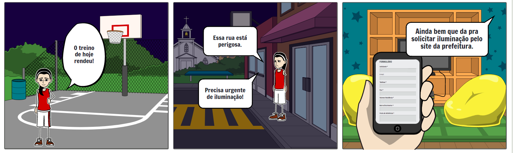
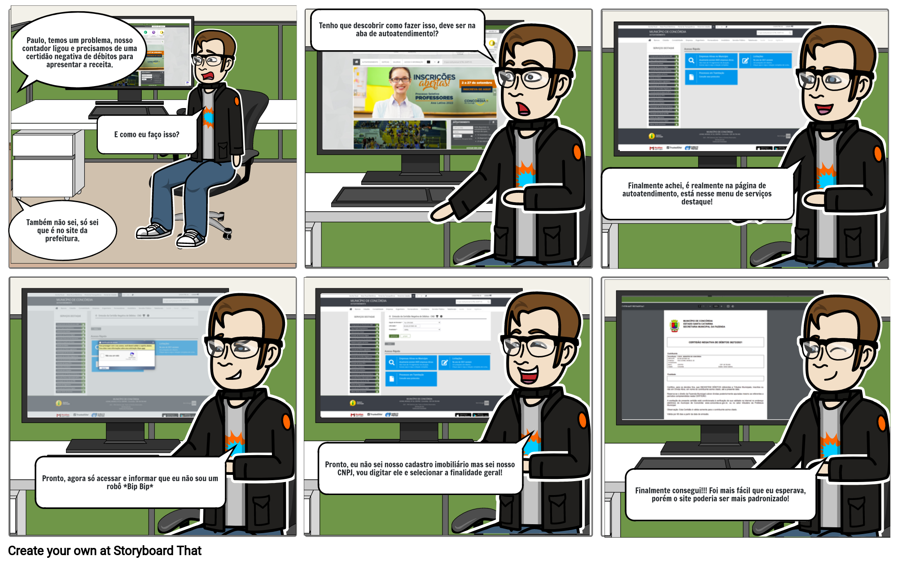
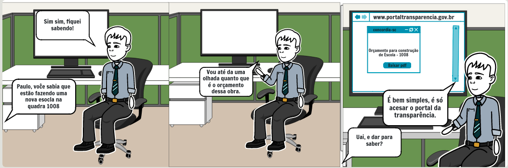
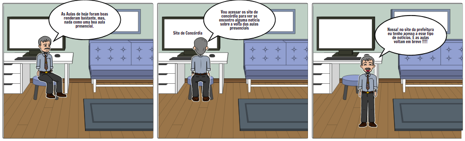
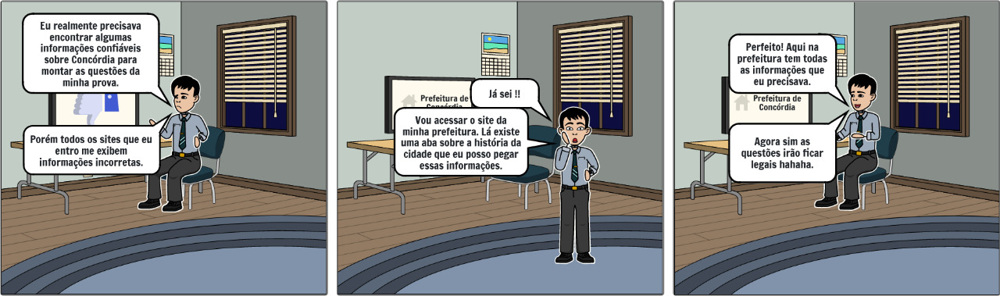

## 1. Versionamento
|Data|Versão|Descrição|Autor(es)
|--|--|--|--|
|04/09|1.0|Criação do documento|João Pedro|
|04/09|1.1|Adição do storyboard de história da cidade|João Pedro|
|05/09|1.2|Adição do storyboard de iluminação pública|Natanael|
|05/09|1.3|Adição do storyboard de notícias|Abraão|
|07/09|1.4|Adição do storyboard de gastos no portal da transparência|Francisco|
|08/09|1.5|Adição do storyboard de certidão negativa de débitos|Leonardo|

## 2. Introdução

 &emsp;&emsp; O storyboard "é um exemplo de prototipação de baixa-fidelidade, geralmente utilizado em um conjunto de cenários" (Preece <i>et al.</i>, 2013, pág. 263) [1]. Sua construção, ainda segundo Preece <i>et al.</i> [1], é feita através de um conjunto de quadrinhos, desenhados ou através de softwares, que demonstram como um usuário pode progredir em uma tarefa utilizando uma ou mais funcionalidades do sistema que se está sendo desenvolvido.

 &emsp;&emsp; Para a realização dessa metodologia, além dos quadrinhos, também foi feito um detalhamento textual acerca das histórias representadas nos storyboards, de forma a facilitar o entendimento sobre a história representada e as pessoas envolvidas

## 3. Resultados
### 3.1 Solicitar Iluminação Pública

|Atividade|Tarefa|Definição|
|:-:|:--|:--|
||**Definição das pessoas envolvidas**|**Persona** Maria Clara Fernandes.|
|**Preparo**|**Definição do ambiente da historia**| Bairro onde se encontra a moradia da persona, especificamente no período noturno.|
||**Definição da tarefa a ser abordada**| Solicitação de iluminação pública.|
||||
||**Definição de quais passos estão envolvidos para realização da tarefa**|1. Acessar o site da prefeitura. 2.Acessar **Portal do Cidadão** no centro da página. 3. Ao centro, acessar menu rotativo opção **Solicitação Iluminação Pública**.  |
|**Sequência**|**Definição do que leva a pessoa a usar a aplicação**| Falta de iluminação nas ruas da cidade.|
||**Definição de qual e como a tarefa será ilustrada**|Solicitar iluminação pública, será ilustrada por uma persona ao andar por seu bairro durante a noite se depara com uma avenida sem iluminação.|
||||
||**Definição da motivação principal da pessoa que usa a aplicação**|Contatar o responsável pela iluminação o mais rápido possível.|
|**Satisfação**|**Definição das realizações que a aplicação permite**|Permite o contato rápido do morador com a secretária da prefeitura para solicitar iluminação pública.|
||**Definição das necessidades que a aplicação se propõe a sanar**|Auxilia aos moradores a comunicar quando a iluminação de uma rua não está funcionando corretamente. Então, a funcionalidade gera sentimentos de conforto, pois a solicitação é rápido e fácil de ser feito. E satisfação, já que o morador se sentirá atendido pela prefeitura.|

<h6 align = "center">Tabela 1: Tabela de storyboard para realização da Solicitação de Iluminação Pública.</h6>
<h6 align = "center">Fonte: Autor.</h6>

<h6 align = "center">Figura 1: Storyboard da Solicitação de Iluminação Pública.</h6>
<h6 align = "center">Fonte: Autor.</h6>

### 3.2 Gerar Certidão Negativa de Débitos

|Atividade|Tarefa|Definição|
|:-:|:--|:--|
||<b>Definição das pessoas envolvidas</b>|<b>Persona</b> Paulo Baruk|
|Preparo|<b>Definição do ambiente da historia</b>|Escritório de arquitetura onde trabalha|
||<b>Definição da tarefa a ser abordada</b>|Emitir Certidão Negativa de Débitos|
||||
||<b>Definição de quais passos estão envolvidos para realização da tarefa</b>|1. Acesso ao site da prefeitura 2. Na Navbar acessar a aba de <b>Autoatendimento</b> 3. Acessar no menu de serviços destaque <b>Emissão da Certidão Negativa de Débitos - CND</b> 4. Clicar no botão <b>Acessar</b> 5. Preencher captcha <b>Não sou um robô</b> 6. Selecionar opção de emissão <b>Por CPF/CNPJ</b> 7. Digitar o  <b>CNPJ e selecionar a finalidade geral</b> 8. Clicar em  <b>Confirmar</b>|
|Sequência|<b>Definição do que leva a pessoa a usar a aplicação</b>|Emitir a CND para meios fiscais e jurídicos|
||<b>Definição de qual e como a tarefa será ilustrada</b>|Emitira uma Certidão Negativa de Débitos para provar que seu imóvel está em dia com a prefeitura.|
||||
||<b>Definição da motivação principal da pessoa que usa a aplicação</b>|Emitir a Certidão Negativa de Débitos de seus imóveis na cidade de Concórdia.|
|Satisfação|<b>Definição das realizações que a aplicação permite</b>|Conforto e praticidade por não ser necessária a ida em locais físicos para gerar o documento.|
||<b>Definição das necessidades que a aplicação se propõe a sanar</b>|Necessidade de confiabilidade das informações, bem como, facilidade e conforto aos usuários que realizam a emissão, além de formas de verificar se o documento é original.|
<h6 align = "center">Tabela 2: Tabela de storyboard para acesso à Emissão da Certidão Negativa de Débitos.</h6>
<h6 align = "center">Fonte: Autor.</h6>

<h6 align = "center">Figura 2: Storyboard da Emissão da Certidão Negativa de Débitos.</h6>
<h6 align = "center">Fonte: Autor.</h6>

### 3.3 Acessar Dado de Gasto no Portal da Transparência

|Atividade|Tarefa|Definição|
|:-:|:--|:--|
||**Definição das pessoas envolvidas**|**Persona** Paulo Baruk|
|**Preparo**|**Definição do ambiente da historia**| No escritório da persona junto com seu colega de trabalho.|
||**Definição da tarefa a ser abordada**| Acessar o portal da transparência para visualizar os gastos do município.|
||||
||**Definição de quais passos estão envolvidos para realização da tarefa**|1. Acessar o portal da transparência. 2.Procurar pelo processo específico no menu principal. 3. Procurar documento sobre orçamento do governo municipal e abrir o documento.  |
|**Sequência**|**Definição do que leva a pessoa a usar a aplicação**| Ter mas transparência sobre os gastos públicos.|
||**Definição de qual e como a tarefa será ilustrada**| A persona quer saber quanto custou a obra publica na sua cidade, nesse caso a construção de uma nova escola.|
||||
||**Definição da motivação principal da pessoa que usa a aplicação**| Ter uma copia do orçamento da obra da sua cidade.|
|**Satisfação**|**Definição das realizações que a aplicação permite**|É um dos meios mais rápidos, eficientes e baratos para mostrar a transparência dos gastos públicos.|
||**Definição das necessidades que a aplicação se propõe a sanar**|É uma das maneiras mais simples e rápidas para fazer a fiscalização do governo municipal atual, para evitar ao máximo o super faturamento do dinheiro público.|

<h6 align = "center">Tabela 3: Tabela de storyboard para Acessar Dado de Gasto no Portal da Transparência .</h6>
<h6 align = "center">Fonte: Autor.</h6>

<h6 align = "center">Figura 3: Storyboard do Acesso de Dados de Gasto no Portal da Transparência.</h6>
<h6 align = "center">Fonte: Autor.</h6>

### 3.4 Acessar Notícias

|Atividade|Tarefa|Definição|
|:-:|:--|:--|
||**Definição das pessoas envolvidas**|**Persona** Pedro Moreira Santiago.|
|**Preparo**|**Definição do ambiente da historia**| Escritório de Pedro em sua residência|
||**Definição da tarefa a ser abordada**| Acessar notícias.|
||||
||**Definição de quais passos estão envolvidos para realização da tarefa**|1. Acessar o site da prefeitura. 2.Acessar **Portal do Cidadão** no centro da página. |
|**Sequência**|**Definição do que leva a pessoa a usar a aplicação**| A busca por noticias da cidade|
||**Definição de qual e como a tarefa será ilustrada**|Acessar notícias, será ilustrada por uma persona em seu escritório em busca de noticias sobre a volta as aulas.|
||||
||**Definição da motivação principal da pessoa que usa a aplicação**|Encontrar informações sobre a volta as aulas.|
|**Satisfação**|**Definição das realizações que a aplicação permite**|Traz aos usuários informações relevantes sobre a cidade.|
||**Definição das necessidades que a aplicação se propõe a sanar**|Ajuda os moradores da cidade a se informarem de maneira segura e confiável sobre questões importantes da cidade como a volta das aulas e diversas outras notícias que a população tem interesse em saber.|

<h6 align = "center">Tabela 4: Tabela de storyboard de Acesso a Noticias.</h6>
<h6 align = "center">Fonte: Autor.</h6>

<h6 align = "center">Figura 4: Storyboard de Acesso a Noticias.</h6>
<h6 align = "center">Fonte: Autor.</h6>

### 3.5 Acessar História da Cidade
|Atividade|Tarefa|Definição|
|:-:|:--|:--|
||<b>Definição das pessoas envolvidas</b>|<b>Persona</b> Pedro Moreira Santiago|
|Preparo|<b>Definição do ambiente da historia</b>|Moradia da persona no período noturno|
||<b>Definição da tarefa a ser abordada</b>|Acesso sobre a história da cidade|
||||
||<b>Definição de quais passos estão envolvidos para realização da tarefa</b>|1. Acesso ao site da prefeitura 2. No menu superior acessar <b>Município</b> 3. Acessar <b>História de Concórdia</b>|
|Sequência|<b>Definição do que leva a pessoa a usar a aplicação</b>|Encontrar informações confiáveis sobre a cidade de Concórdia|
||<b>Definição de qual e como a tarefa será ilustrada</b>|Encontrar informações sobre a história da cidade, sendo ilustrada por uma persona buscando por uma fonte confiável sobre a história de sua cidade.|
||||
||<b>Definição da motivação principal da pessoa que usa a aplicação</b>|Encontrar informações oficiais, confiáveis e de forma rápida sobre a história de Concórdia.|
|Satisfação|<b>Definição das realizações que a aplicação permite</b>|Conforto e praticidade por não ser necessária a pesquisa em diversos sites para se encontrar informações de fontes confiáveis.|
||<b>Definição das necessidades que a aplicação se propõe a sanar</b>|Necessidade de confiabilidade das informações, bem como, facilidade e conforto aos usuários que realizam a pesquisa.|
<h6 align = "center">Tabela 5: Tabela de storyboard para acesso à Histórias da Cidade de Concórdia.</h6>
<h6 align = "center">Fonte: Autor.</h6>

<h6 align = "center">Figura 5: Storyboard da História da Cidade.</h6>
<h6 align = "center">Fonte: Autor.</h6>

## 5. Referências

[1] Preece, J.; Roger, Y.; Sharp, H. <b>Design de Interação: Além da Interação Humano-Computador</b>. Bookman, 3º ed. 2013.

