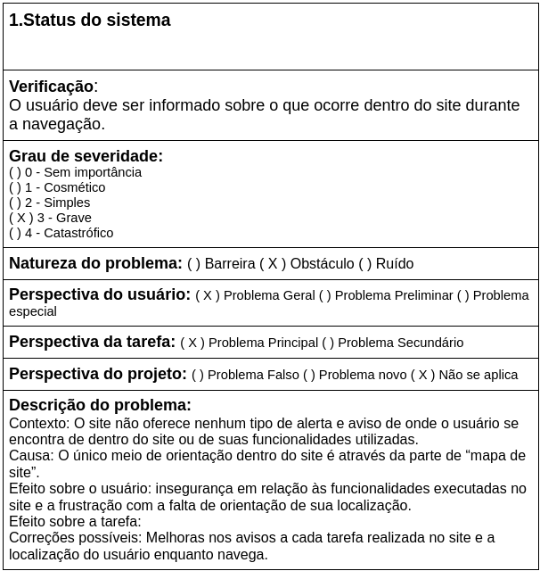
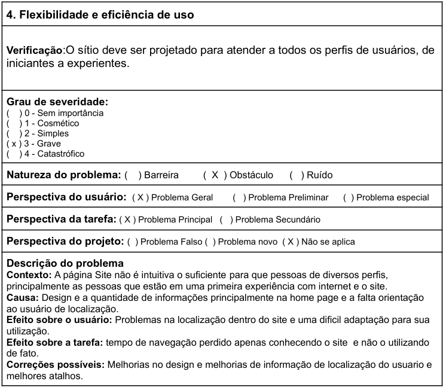
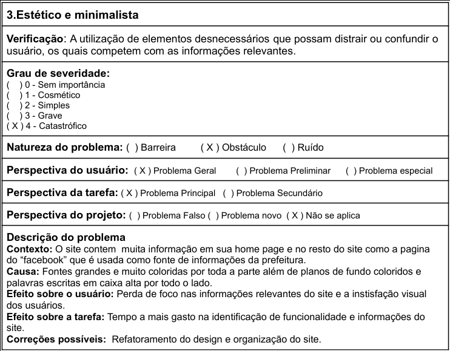
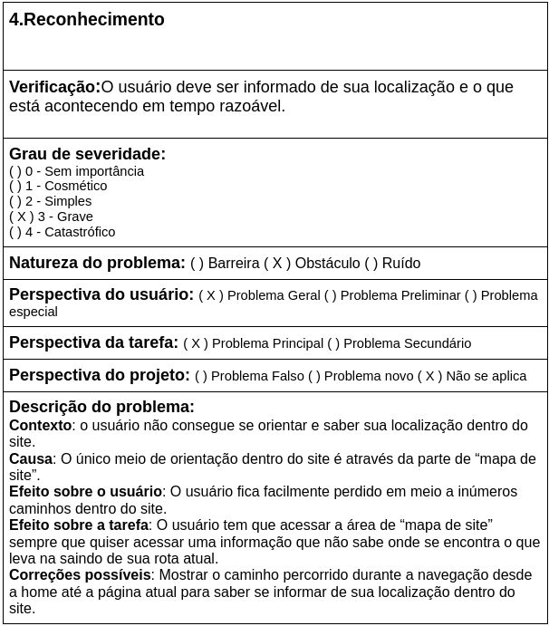

# Execução da Avaliação - Prefeitura de São Sebastião do Alto

## 1. Objetivos

 &emsp;&emsp;Esse documento, como já apresentado previamente no <a href="../planejamentoAbraao">planejamento</a>, estará realizando a valiação como objetivo de identificar os problemas de usabilidade no site da prefeitura de São Sebastião do Alto, utilizando as heurísticas propostas por Nielsen.

## 2. Heurísticas para Web

<h6 align = "center">Tabela 1: Análise da heurística 1.</h6>
<h6 align = "center">Fonte: Autor</h6>

<h6 align = "center">Tabela 2: Análise da heurística 2.</h6>
<h6 align = "center">Fonte: Autor</h6>

<h6 align = "center">Tabela 3: Análise da heurística 3.</h6>
<h6 align = "center">Fonte: Autor</h6>

<h6 align = "center">Tabela 4: Análise da heurística 4.</h6>
<h6 align = "center">Fonte: Autor</h6>

## 3. Conclusão

 &emsp;&emsp;Após feita análise das heurísticas de Nielsien foram vistas que há quatro heurísticas onde se encontram os principais problemas do site, sendo elas: Status do sistema, flexibilidade e eficiência de uso, estética e minimalista e reconhecimento. Sendo seu principal problema na parte de estética e design.

 &emsp;&emsp;O site apresenta uma má organização de interfaces, uma falta de orientação quanto à localização, nenhum aviso quanto às tarefas feitas dentro do site, e uma falta de ajuda a perfis de usuários que não tenham muito contato com a internet.

## 4. Bibliografia

[1] Prefeitura de São Sebastião do Alto. Disponível em: <a href="http://ssalto.rj.gov.br/" target="_blank">http://ssalto.rj.gov.br/</a>. Acesso em: 30 de jul. de 2021

[2] Barbosa, S. D. J.; Silva, B. S. da; Silveira, M. S.; Gasparini, I.; Darin, T.; Barbosa, G. D. J. <b>Interação Humano-Computador e Experiência do usuário</b>. Autopublicação. 2021.

[3] Maciel, C.; Luis, J.; Neumann, L.; Cristina, A. <b>Avaliação Heurística de Sítios na Web</b>.Instituto de Computação - Universidade Federal Fluminense.

