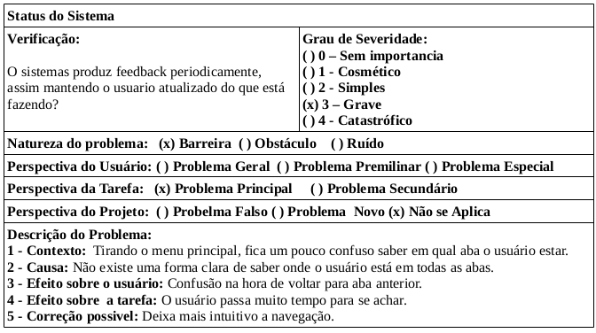
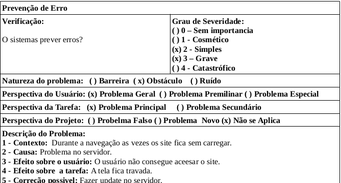
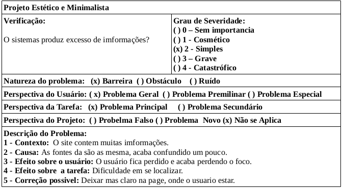

# Execução de Avaliação do Portal da UNB-FGA

## 1. Objetivo
Está avaliação tem como principal Objetivo, avaliar o portal da UNB-FGA [1], conforme explicado no <a href="../planejamentoFrancisco">planejamento</a>, aplicando-se a heurística dita por Nielsen para busca problemas de usabilidade, apresentada através das tabelas apresentada por Maciel[2].

## 2. Execusão da Avaliação Heurísticas 

<h6 align = "center">Tabela 1: Análise da heurística 1.</h6>
<h6 align = "center">Fonte: Autor</h6>

<h6 align = "center">Tabela 2: Análise da heurística 5.</h6>
<h6 align = "center">Fonte: Autor</h6>

<h6 align = "center">Tabela 8: Análise da heurística 1.</h6>
<h6 align = "center">Fonte: Autor</h6>

## 3. Referencias

[1] Universidade de brasilia-fga. Disponível em: <a href="https://fga.unb.br/" target="_blank">https://fga.unb.br/</a>. Acesso em: 29 de jul. de 2021

[2] Maciel, C.; Luis, J.; Neumann, L.; Cristina, A. <b>Avaliação Heurística de Sítios na Web</b>.Instituto de Computação - Universidade Federal Fluminense.

