# Execução da Avaliação - Teams

## 1. Objetivos

 &emsp;&emsp;Documento de <a href="../planejamentoLeonardo">planejamento</a>.

## 2. Heurísticas para Web

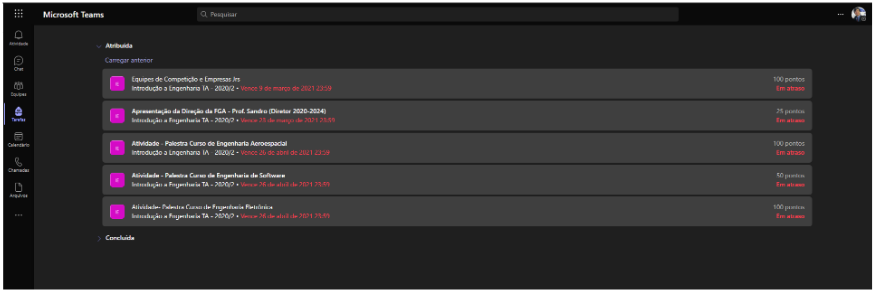

<h6 align = "center">Figura 1: Erro do sistema de atividades.</h6>
<h6 align = "center">Fonte: Teams [1].</h6>

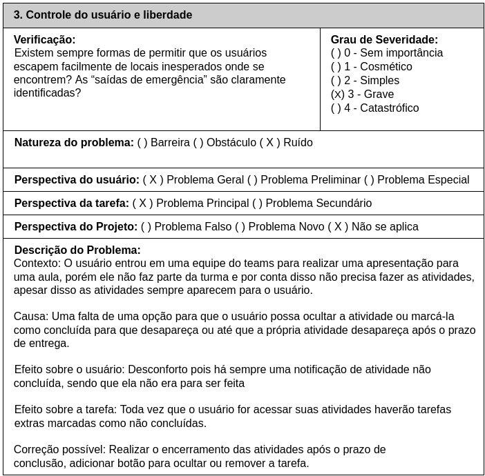

<h6 align = "center">Tabela 1: Análise da heurística 3.</h6>
<h6 align = "center">Fonte: Autor</h6>

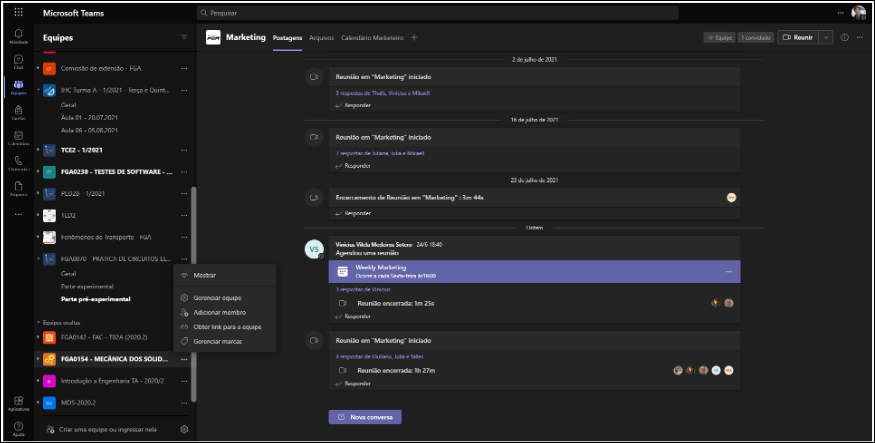

<h6 align = "center">Figura 2: Imagem das opções disponíveis em uma equipe.</h6>
<h6 align = "center">Fonte: Teams [1].</h6>

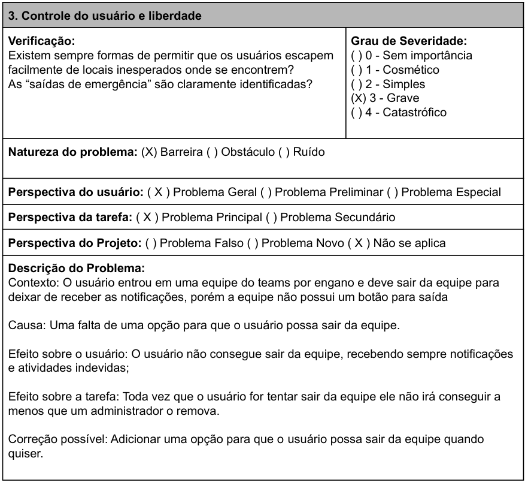

<h6 align = "center">Tabela 2: Análise da heurística 3.</h6>
<h6 align = "center">Fonte: Autor</h6>

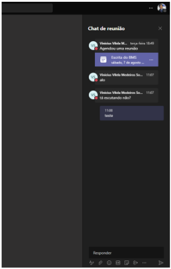

<h6 align = "center">Figura 4: Imagem das opções disponíveis em uma equipe.</h6>
<h6 align = "center">Fonte: Teams [1].</h6>

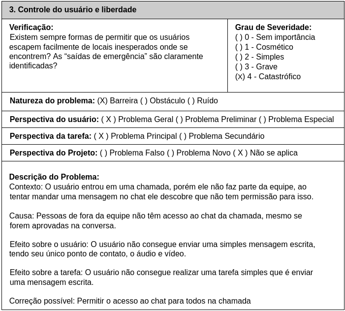

<h6 align = "center">Tabela 3: Análise da heurística 3.</h6>
<h6 align = "center">Fonte: Autor</h6>

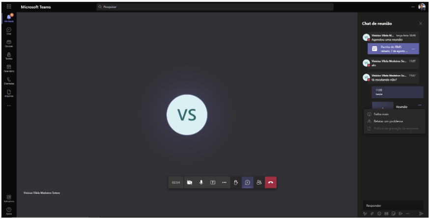

<h6 align = "center">Figura 4: Imagem das opções disponíveis em uma equipe.</h6>
<h6 align = "center">Fonte: Teams [1].</h6>

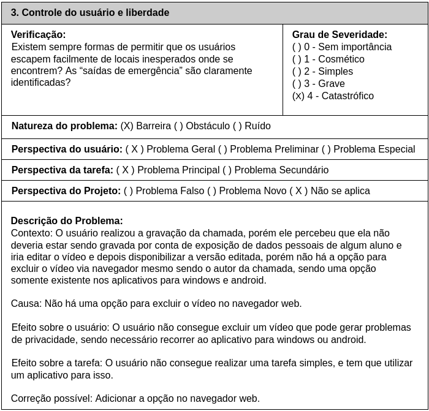

<h6 align = "center">Tabela 4: Análise da heurística 3.</h6>
<h6 align = "center">Fonte: Autor</h6>

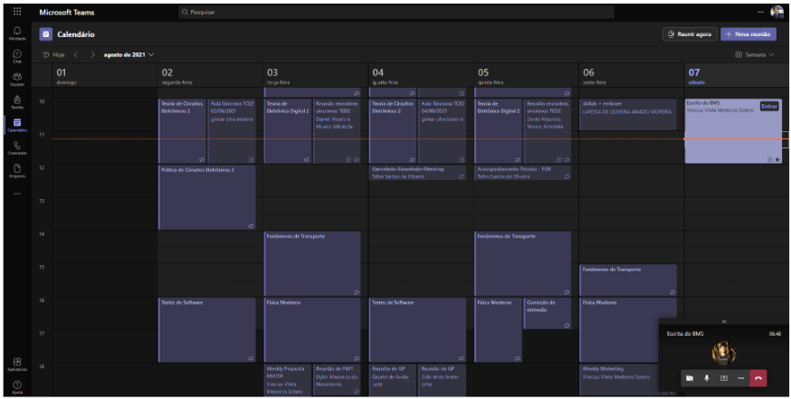

<h6 align = "center">Figura 5: Imagem das opções disponíveis em uma equipe.</h6>
<h6 align = "center">Fonte: Teams [1].</h6>

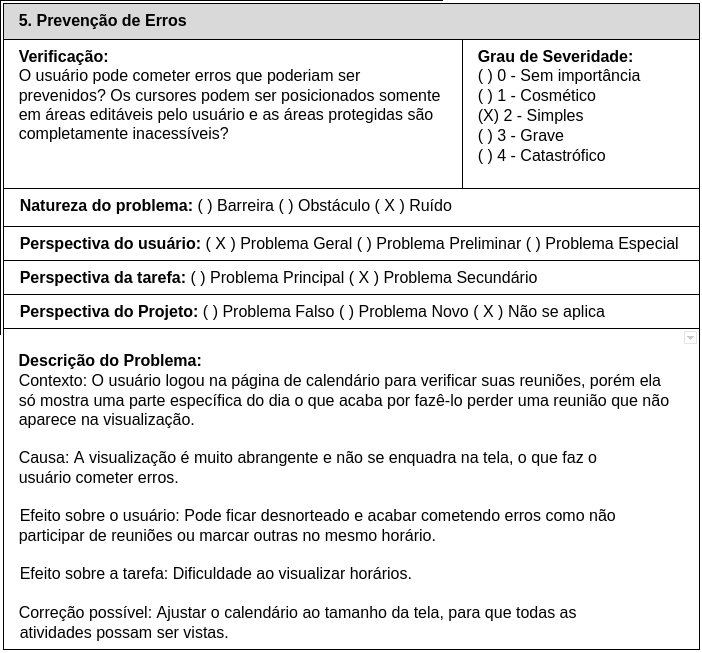

<h6 align = "center">Tabela 5: Análise da heurística 5.</h6>
<h6 align = "center">Fonte: Autor</h6>

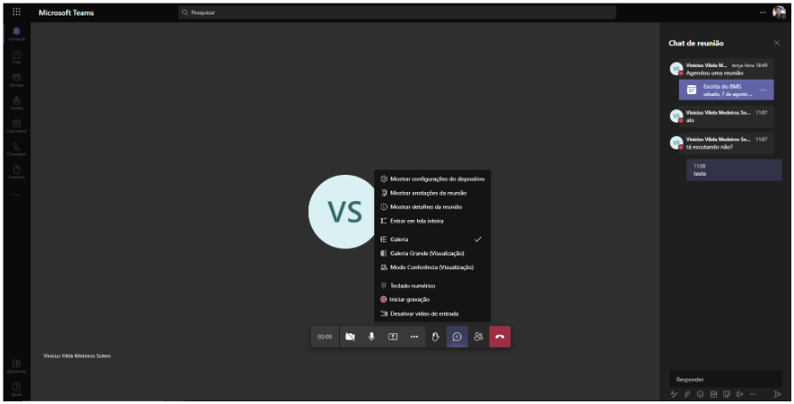

<h6 align = "center">Figura 6: Imagem das opções disponíveis em uma reunião.</h6>
<h6 align = "center">Fonte: Teams [1].</h6>

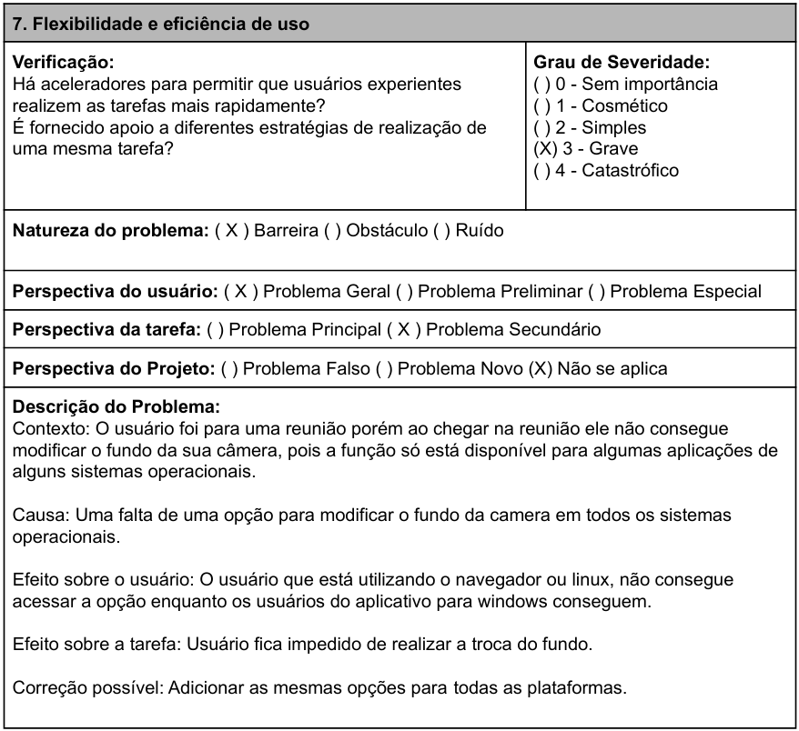

<h6 align = "center">Tabela 6: Análise da heurística 7.</h6>
<h6 align = "center">Fonte: Autor</h6>

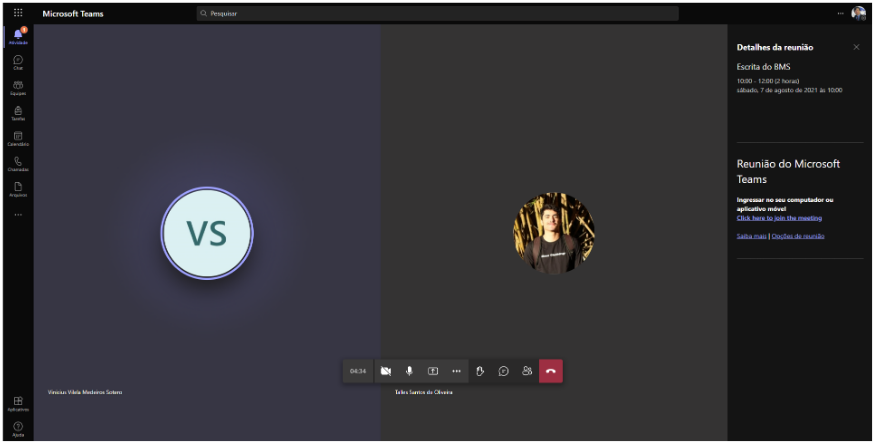

<h6 align = "center">Figura 7: Imagem das opções disponíveis para gerar um link.</h6>
<h6 align = "center">Fonte: Teams [1].</h6>

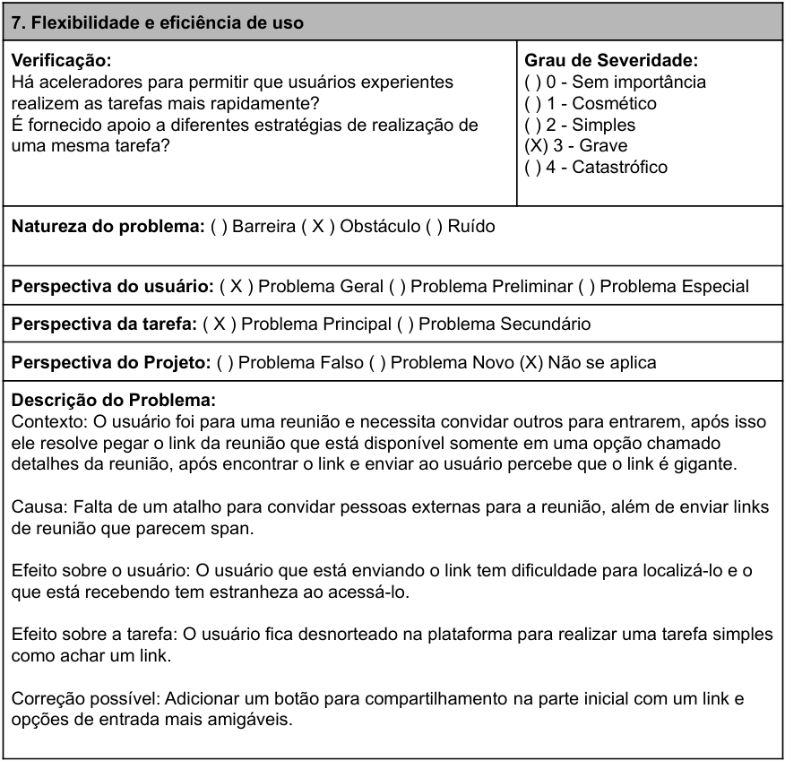

<h6 align = "center">Tabela 7: Análise da heurística 7.</h6>
<h6 align = "center">Fonte: Autor</h6>

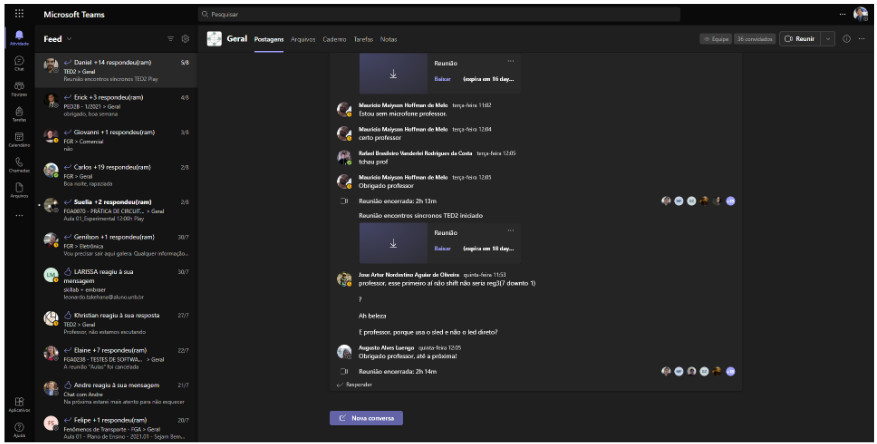

<h6 align = "center">Figura 8: Imagem das opções disponíveis para o histórico.</h6>
<h6 align = "center">Fonte: Teams [1].</h6>

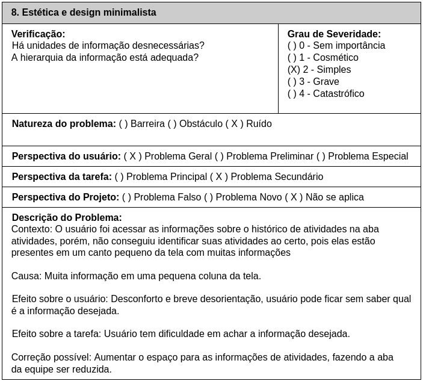

<h6 align = "center">Tabela 8: Análise da heurística 8.</h6>
<h6 align = "center">Fonte: Autor</h6>

## 3. Referências

[1] Plataforma do Teams. Disponível em: <a href="https://teams.microsoft.com/" target="_blank">https://teams.microsoft.com/</a>. Acesso em: 29 de jul. de 2021

