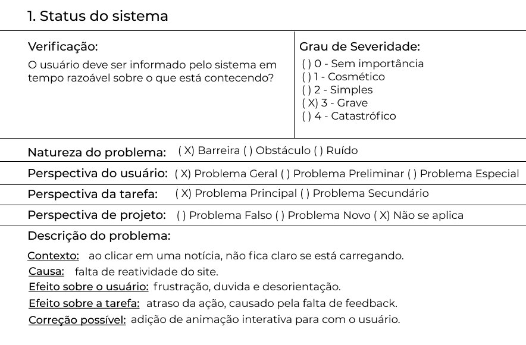
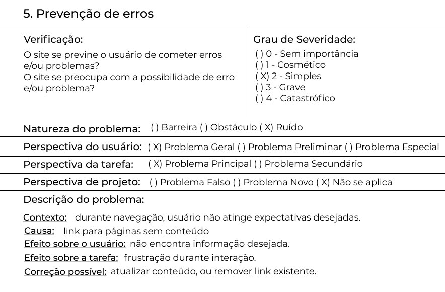
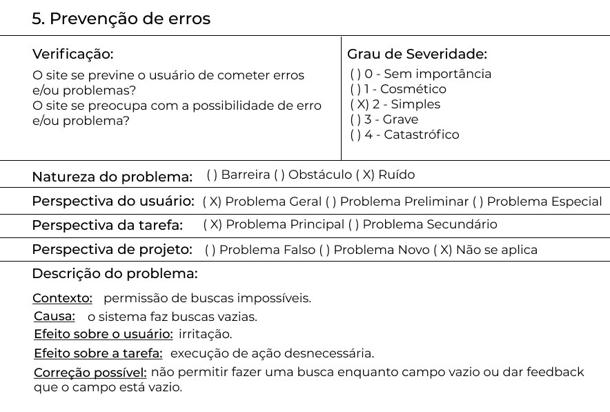
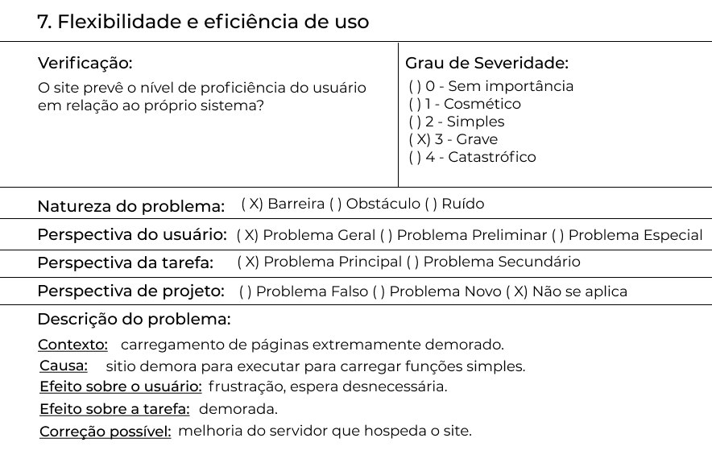
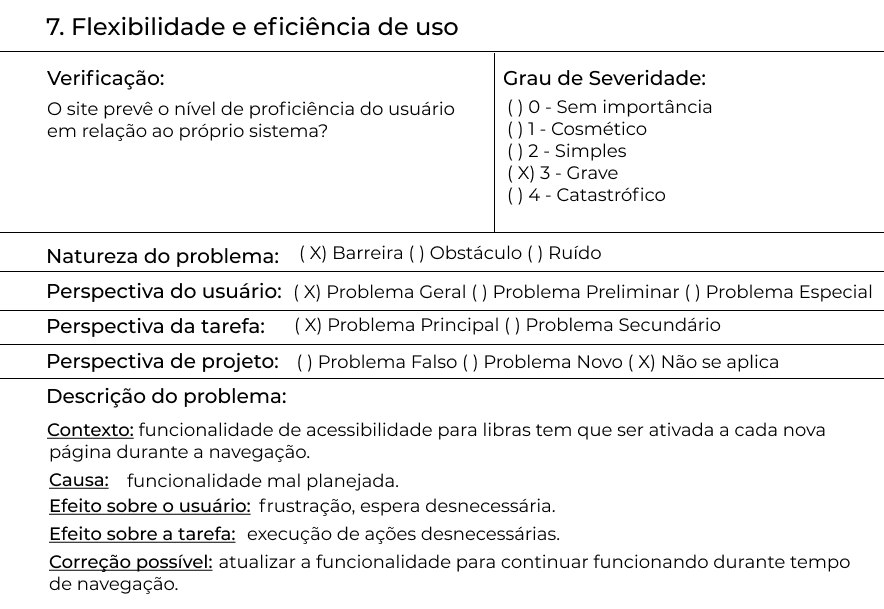
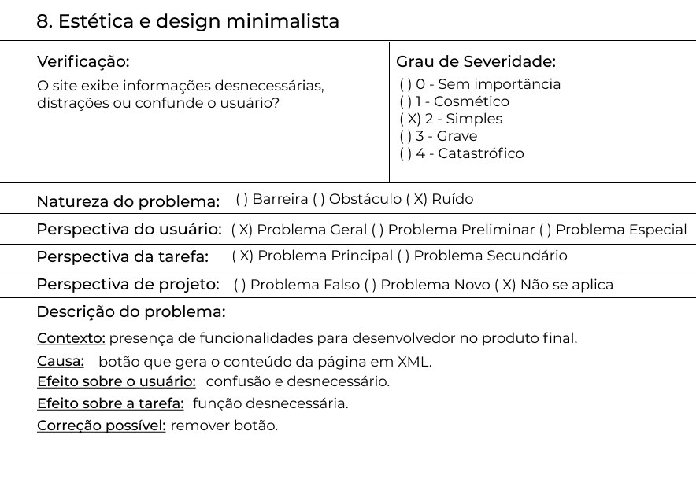

# Execução de avaliação EPL

## Objetivos
Está avaliação, como já apresentado previamente no [planejamento](../planejamentoNatanael), busca analisar o sítio virtual do [EPL](https://www.epl.gov.br/index.php) por possuir problemas de usabilidade seguindo as 10 heurísticas propostas por Nielsen.
## Avaliação Heurística

<h6 align = "center">Tabela 1: Análise da heurística 1.</h6>
<h6 align = "center">Fonte: Autor</h6>

<h6 align = "center">Tabela 2: Análise da heurística 5.</h6>
<h6 align = "center">Fonte: Autor</h6>

<h6 align = "center">Tabela 5: Análise da heurística 5.</h6>
<h6 align = "center">Fonte: Autor</h6>

<h6 align = "center">Tabela 7: Análise da heurística 7.</h6>
<h6 align = "center">Fonte: Autor</h6>

<h6 align = "center">Tabela 7: Análise da heurística 7.</h6>
<h6 align = "center">Fonte: Autor</h6>

<h6 align = "center">Tabela 8: Análise da heurística 8.</h6>
<h6 align = "center">Fonte: Autor</h6>

## Conclusão
Apos analise, foi constatado problemas relacionados a 5 heurísticas, sendo elas status do sistema, prevenção de erros, flexibilidade e eficiência de uso e estética e design minimalista.

O sítio apresenta problemas graves durante navegação, já que há momentos de navegação muito lenta, demora para execução de funcionalidades principais da página e leva a páginas com conteúdos vazios. Portanto, ao invés de o usuário obter as informações, ele acaba se frustrando por não conseguir encontrar o que quer e por levar muito tempo.

A página apresenta uma interface razoável, porém com a presença de muitos elementos desnecessários, o que polui a navegação e sobrecarrega o usuário com informação.

Então, o site esta precisando de mudanças para que sua usabilidade e funcionalidade se direcione para o usuário, pois da forma como se encontra não gera uma boa experiência de uso.
