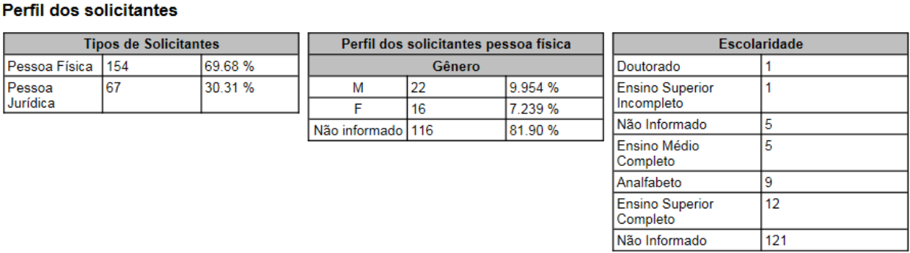
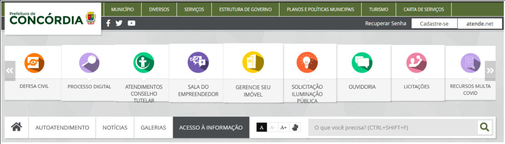
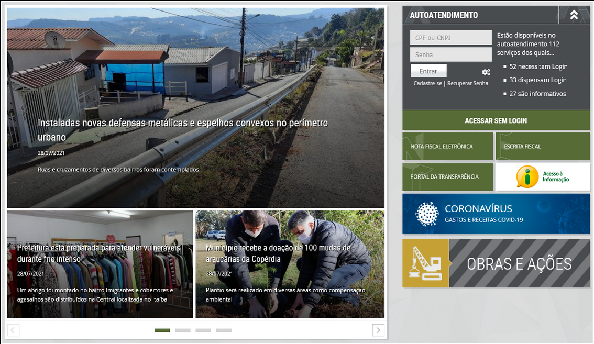

# Planejamento da Avaliação - Prefeitura de Concórdia

## 1. Domínio
<p align = "justify"> &emsp;&emsp;A disponibilização de informações aos cidadãos, a praticidade para o cumprimento das exigências do MPF, e também, a publicação das ações diárias de um município constituem algumas das importâncias dos sites das prefeituras. Entre algumas das informações disponibilizadas está o acesso a processos como: Licitações, Leis, Decretos, Processos Seletivos, Concursos Públicos, entre outros, que possuem papel significativo no dia-a-dia dos cidadãos [1].</p>
<p align = "justify"> &emsp;&emsp;Dessa forma, para permitir o acesso à informação algumas leis devem ser cumpridas no âmbito da transparência. De acordo com algumas exigências do Ministério Público Federal (MPF), obrigações como as previstas na Lei de Acesso à Informação (Lei nº 12.527, de 18 de novembro de 2011) ou na Lei de Transparência (Lei nº 6.924, de 25 de julho de 2009), devem estar presentes nos sites das prefeituras.</p>
<p align = "justify"> &emsp;&emsp;Portanto, o site da Prefeitura de Concórdia se encontra na obrigação de providenciar o acesso aos diversos processos, disponibilizando a informação a todos usuários que acessam o endereço virtual, de forma a cumprir com as diversas leis de transparência e divulgação da informação, além de seguir os diversos princípios de usabilidade.</p>

## 2. Papéis e Perfis de Usuários
<p align = "justify"> &emsp;&emsp;Dentre os principais perfis de usuários que acessam e fazem a utilização do site da Prefeitura de São Sebastião do Alto, estão presentes aqueles que buscam mais informações sobre seu município e história, notícias e/ou sobre os processos já citados anteriormente.</p>
<p align = "justify"> &emsp;&emsp;De acordo com informações geradas pelo próprio site [2] durante o período de janeiro de 2020 até julho de 2021, foi constatado que um total de 328 pessoas realizaram acesso ao sítio eletrônico em busca de informações. Desse total, 69.68% representado por pessoas físicas e 30.31% por pessoas jurídicas. Em relação ao gênero, dos perfis informados 9.954% eram masculinos e 7.239% femininos. E por fim em relação à escolaridade, constatou-se que 12 pessoas possuíam ensino superior completo, 5 possuíam ensino médio completo e 9 eram analfabetos.</p>


<h6 align = "center">Figura 1: Perfil dos solicitantes que acessam o site da prefeitura de Concórdia.</h6>
<h6 align = "center">Fonte: Retirada do relatório gerado pela prefeitura de concórdia em relação aos acessos de informação [2].</h6>

## 3. Objetivos
<p align = "justify"> &emsp;&emsp;Observando os papéis e perfis de usuários apresentados percebe-se a diversidade de situações de escolaridade, principalmente por acessos de pessoas sem escolaridade. Com esses dados, é perceptível a necessidade de uma avaliação da interface para constatar o seguimento dos princípios de usabilidade, além de buscar problemas e suas possíveis soluções de reprojeto.</p>
<p align = "justify"> &emsp;&emsp;A avaliação buscando responder alguns aspectos da interface de forma a gerar dados qualitativos, então estará de acordo com o proposto por Diniz et al. (pág. 250) [3], em relação a apropriação da tecnologia:</p>
```
- Quais objetivos dos usuários podem ser alcançados através do sistema? E quais não podem? Quais necessidades e desejos foram ou não atendidos?
- A tecnologia disponível pode oferecer maneiras mais interessantes ou eficientes de os usuários atingirem seus objetivos?
- O que é possível modificar no sistema interativo para adequá-lo melhor ao ambiente de trabalho?
``` 
<p align = "justify"> &emsp;&emsp;Em relação a conformidade com um padrão:</p>
```
- O sistema está de acordo com os padrões de acessibilidade da Lei de Acesso à Informação?
- A interface segue o padrão do sistema operacional? E da empresa?
```
<p align = "justify"> &emsp;&emsp;E em relação a identificação de problemas de interação e na interface:</p>
```
- Ele atingiu seu objetivo? Com quanta eficiência? Em quanto tempo? Após cometer quantos erros?
- Que parte da interface e da interação o deixa insatisfeito?
- Ele entende o que significa e para que serve cada elemento de interface?
- Quais barreiras o usuário encontra para atingir seus objetivos?
```

## 4. Escopo
<p align = "justify"> &emsp;&emsp;O escopo dessa avaliação então se restringirá apenas ao sítio principal da prefeitura de Concórdia, não envolvendo seus subportais nem os endereços virtuais de autoatêndimento.</p>

<h6 align = "center">Figura 2: Cabeçalho da tela principal.</h6>
<h6 align = "center">Fonte: Site da prefeitura de Concórdia [4].</h6>

<h6 align = "center">Figura 3: Área principal onde são disponibilizadas várias informações.</h6>
<h6 align = "center">Fonte: Site da prefeitura de Concórdia [4].</h6>

## 5. Método
<p align = "justify"> &emsp;&emsp;A metodologia escolhida então para essa etapa inicial da avaliação do site da prefeitura de Concórdia, será o por inspeção através das avaliações heurísticas propostas por Nielsen (2000), de forma a validar a presença das 10 heurísticas de usabilidades, e caso sejam encontrados problemas, identificá-los e propor soluções de reprojeto.</p>
<p align = "justify"> &emsp;&emsp;As 10 heurísticas sendo constituídas por</p>
- Visibilidade e reconhecimento do estado ou contexto atual do sistema
- Compatibilidade com o mundo real
- Controle e Liberdade do usuário
- Consistência e padrões
- Prevenção de erros
- Reconhecimento ao invés de memorização
- Flexibilidade e eficiência
- Projeto estético e minimalista
- Diagnosticar e corrigir erros
- Ajuda e Documentação

## 6. Avaliação
<p style="text-align: center; font-size:130%">Link para a <a href="../execucaoJoao">execução</a> da avaliação.</p>

## 7. Referências
<p style="text-align: justify; text-indent: 20px">[1] Ananias, B. <b>Importância do site para Prefeitura: Lei de Transparência</b>. Netzee. 19 de jun. de 2017. Disponível em: <a href="https://blog.netzee.com.br/importancia-do-site-para-prefeitura-lei-de-transparencia/#:~:text=O%20site%20das%20prefeituras%20tem,Concursos%20P%C3%BAblicos%2C%20entre%20tantos%20outros" target="_blank">https://blog.netzee.com.br/importancia-do-site-para-prefeitura-lei-de-transparencia/#:~:text=O%20site%20das%20prefeituras%20tem,Concursos%20P%C3%BAblicos%2C%20entre%20tantos%20outros</a>. Acesso em: 29 de jul. de 2021</p>

<p style="text-align: justify; text-indent: 20px">[2] Estatísticas de solicitações, Prefeitura de Concórdia. Disponível em: <a href="https://concordia.atende.net/cidadao/acesso-informacao/estatistica" target="_blank">https://concordia.atende.net/cidadao/acesso-informacao/estatistica</a>. Acesso em: 29 de jul. de 2021</p>

<p style="text-align: justify; text-indent: 20px">[3] Barbosa, S. D. J.; Silva, B. S. da; Silveira, M. S.; Gasparini, I.; Darin, T.; Barbosa, G. D. J. <b>Interação Humano-Computador e Experiência do usuário</b>. Autopublicação. 2021.</p>

<p style="text-align: justify; text-indent: 20px">[4] Prefeitura de Concórdia. Disponível em: <a href="https://concordia.atende.net/cidadao" target="_blank">https://concordia.atende.net/cidadao</a>. Acesso em: 29 de jul. de 2021</p>
