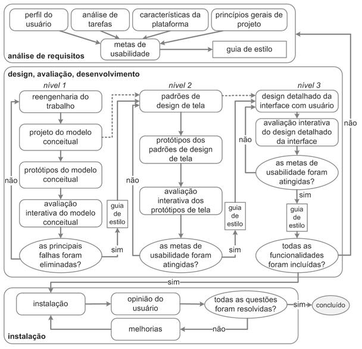

# Documento de Processo de Design

## Versionamento
|Data|Versão|Descrição|Autor(es)
|--|--|--|--|
|11/08|1.0|Adição do documento de processo de  design|Abraão Alves| 

 &emsp;&emsp;Um processo de design envolve o detalhamento das atividades básicas de análise da situação atual (identificação do problema), síntese de uma intervenção e a avaliação dessa intervenção projetada ou já aplicada à situação atual. Definindo: como executar cada atividade, a sequência em que elas devem ser executadas, quais atividades podem se repetir, e por quais motivos, e os artefatos consumidos e produzidos em cada uma delas. 

 &emsp;&emsp; O processo de design que será usado é o de Engenharia de Usabilidade de Mayhew. Pois, o processo consegue mostra de forma simples e clara cada cada uma das etapas a ser realizada que é dividido em três fases desse processo iterativo: análise de requisitos, design/avaliação/desenvolvimento e instalação.

  &emsp;&emsp;Na fase de <b>análise de requisitos</b> são definidas as metas de usabilidade com base no perfil dos usuários, análise de tarefas, possibilidades e limitações da plataforma em que o sistema será executado e princípios gerais de design de IHC.

  &emsp;&emsp;A fase de <b>design, avaliação</b> e desenvolvimento tem por objetivo conceber uma solução de IHC que atenda às metas de usabilidade estabelecidas na fase anterior.

  &emsp;&emsp; Na fase de <b>instalação</b>, o designer deve coletar opiniões dos usuários depois de algum tempo de uso. Essas opiniões serão úteis para melhorar o sistema em versões futuras ou até mesmo para apontar a necessidade de desenvolver novos sistemas interativos ainda não previstos.

<h6 align = "center">Figura 1: Ciclo de Vida de Usabilidade de Mayhew</h6>
<h6 align = "center">Figura retirada do livro Interação Humano-Computador de BARBOSA et al. (2021, pag.106)</h6>

## Referências 

 [1] BARBOSA, Simone Diniz Junqueira; SILVA, Bruno Santana da SILVEIRA, Milene Selbach; GASPARINI, Isabela; DARIN, Ticianne; BARBOSA, Gabriel Diniz Junqueira. Interação Humano-Computador e Experiência do Usuário. Rio de Janeiro: [s. n.], 2021.

